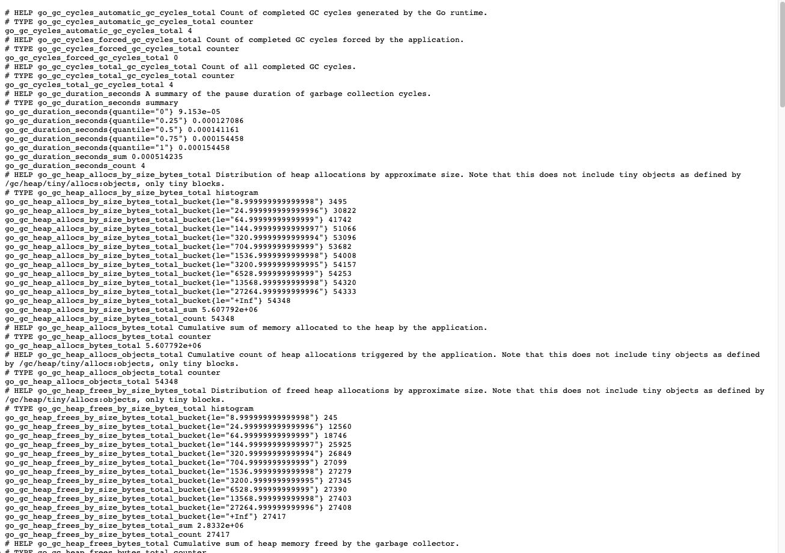

Create [gofiber/fiber](https://github.com/gofiber/fiber) server with rk-boot and rk-fiber plugins.

## Overview
We will use rk-boot start [gofiber/fiber](https://github.com/gofiber/fiber)  microservice and add /v1/greeter API into it.

Furthermore, we will enable bellow functionalities.

| Functionality         | Description                                                 |
|:----------------------|:------------------------------------------------------------|
| Swagger UI            | Enable Swagger UI                                           |
| API Docs UI           | Enable RapiDoc UI                                           |
| Prometheus Client     | Enable Prometheus Client                                    |
| Logging middleware    | Automatically record logs for every API calls               |
| Prometheus middleware | Automatically record prometheus metrics for every API calls |
| Meta middleware       | Automatically add requestID for every API response          |

## Install
```bash
go get github.com/rookie-ninja/rk-boot/v2
go get github.com/rookie-ninja/rk-fiber
```

## 1. Create boot.yaml
```yaml
fiber:
  - name: greeter
    port: 8080
    enabled: true
    sw:
      enabled: true               # Enable Swagger UI，default path: /sw
    docs:
      enabled: true               # Enable API Doc UI，default path: /docs
    prom:
      enabled: true               # Enable Prometheus Client，default path: /metrics
    middleware:
      logging:
        enabled: true
      prom:
        enabled: true
      meta:
        enabled: true
```

## 2. Create main.go
In order to generate swagger.json file, we add comments and generate swagger.json file with [swag](https://github.com/swaggo/swag) CLI.

```go
// Copyright (c) 2021 rookie-ninja
//
// Use of this source code is governed by an Apache-style
// license that can be found in the LICENSE file.

package main

import (
  "context"
  "fmt"
  "github.com/gofiber/fiber/v2"
  "github.com/rookie-ninja/rk-boot/v2"
  "github.com/rookie-ninja/rk-fiber/boot"
  "net/http"
)

// @title Swagger Example API
// @version 1.0
// @description This is a sample rk-demo server.
// @termsOfService http://swagger.io/terms/

// @securityDefinitions.basic BasicAuth

// @contact.name API Support
// @contact.url http://www.swagger.io/support
// @contact.email support@swagger.io

// @license.name Apache 2.0
// @license.url http://www.apache.org/licenses/LICENSE-2.0.html
func main() {
  // Create a new boot instance.
  boot := rkboot.NewBoot()

  // Bootstrap
  boot.Bootstrap(context.TODO())

  // Register handler
  entry := rkfiber.GetFiberEntry("greeter")
  entry.App.Get("/v1/greeter", Greeter)
  // This is required!!!
  entry.RefreshFiberRoutes()

  boot.WaitForShutdownSig(context.TODO())
}

// Greeter handler
// @Summary Greeter
// @Id 1
// @Tags Hello
// @version 1.0
// @Param name query string true "name"
// @produce application/json
// @Success 200 {object} GreeterResponse
// @Router /v1/greeter [get]
func Greeter(ctx *fiber.Ctx) error {
  ctx.Response().SetStatusCode(http.StatusOK)
  return ctx.JSON(&GreeterResponse{
    Message: fmt.Sprintf("Hello %s!", ctx.Query("name")),
  })
}

type GreeterResponse struct {
  Message string
}
```

## 3.Generate swagger.json

```bash
$ swag init
```

## 4.Directory hierarchy
```bash
$ tree
.
├── boot.yaml
├── docs
│   ├── swagger.json
│   └── swagger.yaml
├── go.mod
├── go.sum
└── main.go
```

## 5.Run main.go
```bash
$ go run main.go
2022-05-12T09:31:45.405+0800    INFO    boot/fiber_entry.go:705 Bootstrap fiberEntry    {"eventId": "d43cfb13-e7ee-420a-9143-545b016723f4", "entryName": "greeter", "entryType": "FiberEntry"}
2022-05-12T09:31:45.407+0800    INFO    boot/fiber_entry.go:417 SwaggerEntry: http://localhost:8080/sw/
2022-05-12T09:31:45.407+0800    INFO    boot/fiber_entry.go:420 DocsEntry: http://localhost:8080/docs/
2022-05-12T09:31:45.407+0800    INFO    boot/fiber_entry.go:423 PromEntry: http://localhost:8080/metrics
------------------------------------------------------------------------
endTime=2022-05-12T09:31:45.407095+08:00
startTime=2022-05-12T09:31:45.405534+08:00
elapsedNano=1560417
timezone=CST
ids={"eventId":"d43cfb13-e7ee-420a-9143-545b016723f4"}
app={"appName":"rk","appVersion":"local","entryName":"greeter","entryType":"FiberEntry"}
env={"arch":"amd64","domain":"*","hostname":"lark.local","localIP":"192.168.1.104","os":"darwin"}
payloads={"docsEnabled":true,"docsPath":"/docs/","fiberPort":8080,"promEnabled":true,"promPath":"/metrics","promPort":8080,"swEnabled":true,"swPath":"/sw/"}
counters={}
pairs={}
timing={}
remoteAddr=localhost
operation=Bootstrap
resCode=OK
eventStatus=Ended
EOE
```

## 6.Validate
### 6.1 Swagger UI
[http://localhost:8080/sw/](http://localhost:8080/sw/)


### 6.2 API Docs UI
[http://localhost:8080/docs/](http://localhost:8080/docs/)


### 6.3 Prometheus Client
[http://localhost:8080/metrics](http://localhost:8080/metrics)



### 6.4 Send request
```bash
$ curl -vs "localhost:8080/v1/greeter?name=rk-dev"
* ...
< X-Request-Id: d95d3b00-0d10-4784-83bf-bf392cf8bd77
< X-Rk-App-Domain: *
< X-Rk-App-Name: rk
< X-Rk-App-Unix-Time: 2022-04-14T17:04:39.458193+08:00
< X-Rk-App-Version: local
< X-Rk-Received-Time: 2022-04-14T17:04:39.458193+08:00
< ...
{"Message":"Hello rk-dev!"}
```

### 6.5 API Log
rk-boot will use bellow format of logging. JSON is also supported, please see user guide for details.

```bash
------------------------------------------------------------------------
endTime=2022-05-12T09:32:27.487736+08:00
startTime=2022-05-12T09:32:27.487473+08:00
elapsedNano=263091
timezone=CST
ids={"eventId":"37a14783-f2e9-49da-8839-64f6c4697f55","requestId":"37a14783-f2e9-49da-8839-64f6c4697f55"}
app={"appName":"rk","appVersion":"local","entryName":"greeter","entryType":"FiberEntry"}
env={"arch":"amd64","domain":"*","hostname":"lark.local","localIP":"192.168.1.104","os":"darwin"}
payloads={"apiMethod":"GET","apiPath":"/v1/greeter","apiProtocol":"HTTP/1.1","apiQuery":"name=rk-dev","userAgent":"curl/7.64.1"}
counters={}
pairs={}
timing={}
remoteAddr=127.0.0.1:64411
operation=/v1/greeter
resCode=200
eventStatus=Ended
EOE
```

### 6.6 Prometheus Metrics
Access [http://localhost:8080/metrics](http://localhost:8080/metrics)


## _**Cheers**_
