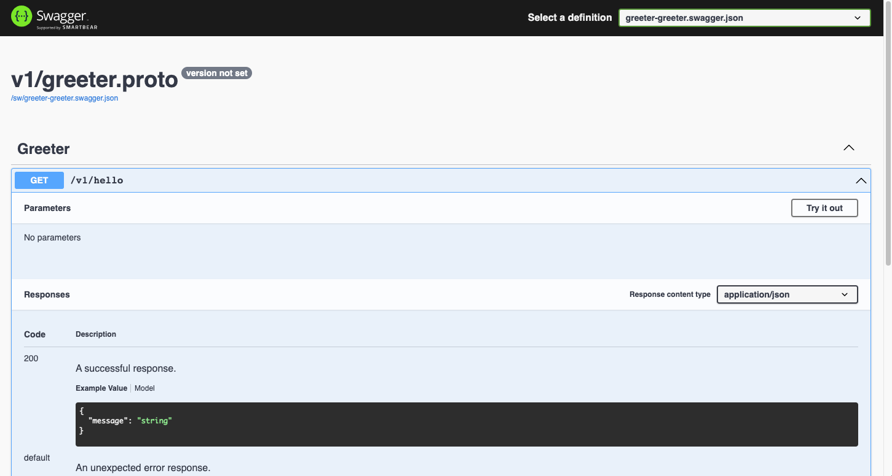

Create [gRPC](https://grpc.io/docs/languages/go/quickstart/) server with rk-boot and rk-grpc plugins.

## Overview
We will use rk-boot start [gRPC](https://grpc.io) microservice and add /v1/hello API into it.

Furthermore, we will enable bellow functionalities.

| Functionality         | Description                                                 |
|:----------------------|:------------------------------------------------------------|
| Swagger UI            | Enable Swagger UI                                           |
| API Docs UI           | Enable RapiDoc UI                                           |
| Prometheus Client     | Enable Prometheus Client                                    |
| Logging middleware    | Automatically record logs for every API calls               |
| Prometheus middleware | Automatically record prometheus metrics for every API calls |
| Meta middleware       | Automatically add requestID for every API response          |

## Install gRPC related CLI
> In order to compile [protocol buffer](https://grpc.io/docs/languages/go/quickstart/), we need to install a couple of CLI.
>
> User can use [rk](https://github.com/rookie-ninja/rk) to install them quickly.

```bash
# Install RK CLI
$ go get -u github.com/rookie-ninja/rk/cmd/rk

# List available installation
$ rk install
COMMANDS:
    buf                      install buf on local machine
    cfssl                    install cfssl on local machine
    cfssljson                install cfssljson on local machine
    gocov                    install gocov on local machine
    golangci-lint            install golangci-lint on local machine
    mockgen                  install mockgen on local machine
    pkger                    install pkger on local machine
    protobuf                 install protobuf on local machine
    protoc-gen-doc           install protoc-gen-doc on local machine
    protoc-gen-go            install protoc-gen-go on local machine
    protoc-gen-go-grpc       install protoc-gen-go-grpc on local machne
    protoc-gen-grpc-gateway  install protoc-gen-grpc-gateway on local machine
    protoc-gen-openapiv2     install protoc-gen-openapiv2 on local machine
    swag                     install swag on local machine
    rk-std                   install rk standard environment on local machine
    help, h                  Shows a list of commands or help for one command

# Install buf, protoc-gen-go, protoc-gen-go-grpc, protoc-gen-grpc-gateway, protoc-gen-openapiv2
$ rk install protoc-gen-go
$ rk install protoc-gen-go-grpc
$ rk install protoc-gen-go-grpc-gateway
$ rk install protoc-gen-openapiv2
$ rk install buf
```

| CLI                                                                           | Description                             | 安装                                                                     |
|-------------------------------------------------------------------------------|-----------------------------------------|------------------------------------------------------------------------|
| [buf](https://docs.buf.build)                                                 | Compile protocol buffer API             | [Install](https://docs.buf.build/installation)                         |
| [protoc-gen-go](https://github.com/golang/protobuf/tree/master/protoc-gen-go) | Generate .go files                      | [Install](https://grpc.io/docs/languages/go/quickstart/)               |
| [protoc-gen-go-grpc](https://github.com/grpc/grpc-go)                         | Generate gRPC related .go files         | [Install](https://grpc.io/docs/languages/go/quickstart/)               |
| [protoc-gen-grpc-gateway](https://github.com/grpc-ecosystem/grpc-gateway)     | Generate grpc-gateway related .go files | [Install](https://github.com/grpc-ecosystem/grpc-gateway#installation) |
| [protoc-gen-openapiv2](https://github.com/grpc-ecosystem/grpc-gateway)        | Generate swagger UI related .json files | [Install](https://github.com/grpc-ecosystem/grpc-gateway#installation) |

## Install
```bash
go get github.com/rookie-ninja/rk-boot/v2
go get github.com/rookie-ninja/rk-grpc/v2
```

## 1. Create greeter.proto
Create greeter.proto file at **api/v1** folder.

```protobuf
syntax = "proto3";

package api.v1;

option go_package = "api/v1/greeter";

service Greeter {
  rpc Hello (HelloRequest) returns (HelloResponse) {}
}

message HelloRequest {}

message HelloResponse {
  string message = 1;
}
```

## 2. Copy googleapis files
rk-grpc plugin use some data structures in googleapi. We recommend putting those proto files in project folder.

Copy files from [github/googleapi](https://github.com/googleapis/googleapis), or copy from [rk-boot](https://github.com/rookie-ninja/rk-boot/tree/main/example/web/grpc/third-party).

Please copy files into third-party folder.

```bash
third-party
    └── googleapis
        └── google
            ├── api
            │   ├── annotations.proto
            │   ├── http.proto
            │   └── httpbody.proto
            └── rpc
                ├── code.proto
                ├── error_details.proto
                └── status.proto
```

## 3. Create buf related config files
> **buf.yaml**

```yaml
version: v1beta1
name: github.com/rk-dev/rk-boot
build:
  roots:
    - api
    - third-party/googleapis
```

> **buf.gen.yaml**

```yaml
version: v1beta1
plugins:
  - name: go
    out: api/gen
    opt:
      - paths=source_relative
  - name: go-grpc
    out: api/gen
    opt:
      - paths=source_relative
      - require_unimplemented_servers=false
  - name: grpc-gateway
    out: api/gen
    opt:
      - paths=source_relative
      - grpc_api_configuration=api/v1/gw_mapping.yaml
      - allow_repeated_fields_in_body=true
      - generate_unbound_methods=true
  - name: openapiv2
    out: api/gen
    opt:
      - grpc_api_configuration=api/v1/gw_mapping.yaml
      - allow_repeated_fields_in_body=true
```

> **api/v1/gw_mapping.yaml**

```yaml
type: google.api.Service
config_version: 3

# Please refer google.api.Http in third-party/googleapis/google/api/http.proto file for details.
http:
  rules:
    - selector: api.v1.Greeter.Hello
      get: /v1/hello
```

> **Run buf command**

```bash
$ buf generate --path api/v1
# By configuration in buf.gen.yaml, generated files would be write to api/gen folder
$ tree
.
├── api
│   ├── gen
│   │   ├── google
│   │   │   ...
│   │   └── v1
│   │       ├── greeter.pb.go
│   │       ├── greeter.pb.gw.go
│   │       ├── greeter.swagger.json
│   │       └── greeter_grpc.pb.go
│   └── v1
│       ├── greeter.proto
│       └── gw_mapping.yaml
├── boot.yaml
├── buf.gen.yaml
├── buf.yaml
├── go.mod
├── go.sum
├── main.go
└── third-party
    └── googleapis
        ...
```

## 4. Create boot.yaml
```yaml
grpc:
  - name: greeter
    port: 8080
#   gwPort: 8081                  # Optional, default: gateway port will be the same as grpc port if not provided
    enabled: true  
    enableReflection: true        # Enable gRPC reflection mainly for grpcurl
    enableRkGwOption: true        # Enable RK style grpc-gateway options
    sw:
      enabled: true               # Enable Swagger UI，default path: /sw
    docs:
      enabled: true               # Enable API Doc UI，default path: /docs
    prom:
      enabled: true               # Enable Prometheus Client，default path: /metrics
    middleware:
      logging:
        enabled: true
      prom:
        enabled: true
      meta:
        enabled: true
```

## 5. Create main.go
```go
// Copyright (c) 2021 rookie-ninja
//
// Use of this source code is governed by an Apache-style
// license that can be found in the LICENSE file.

package main

import (
	"context"
	"github.com/rookie-ninja/rk-boot/v2"
	"github.com/rookie-ninja/rk-demo/api/gen/v1"
	"github.com/rookie-ninja/rk-grpc/v2/boot"
	"google.golang.org/grpc"
)

func main() {
	boot := rkboot.NewBoot()

	// 注册 RPC
	entry := rkgrpc.GetGrpcEntry("greeter")
	entry.AddRegFuncGrpc(registerGreeter)
	entry.AddRegFuncGw(greeter.RegisterGreeterHandlerFromEndpoint)

	// 启动
	boot.Bootstrap(context.TODO())

	// 等待关闭信号
	boot.WaitForShutdownSig(context.TODO())
}

func registerGreeter(server *grpc.Server) {
	greeter.RegisterGreeterServer(server, &GreeterServer{})
}

type GreeterServer struct{}

func (server *GreeterServer) Hello(_ context.Context, _ *greeter.HelloRequest) (*greeter.HelloResponse, error) {
	return &greeter.HelloResponse{
		Message: "Hello!",
	}, nil
}
```

## 6. Run main.go
```bash
$ go run main.go 
2022-04-14T16:25:23.538+0800    INFO    boot/grpc_entry.go:960  Bootstrap grpcEntry     {"eventId": "f09d0b94-b491-4148-8438-3e65610fbdde", "entryName": "greeter", "entryType": "gRPCEntry"}
2022-04-14T16:25:23.542+0800    INFO    boot/grpc_entry.go:681  SwaggerEntry: http://localhost:8080/sw/
2022-04-14T16:25:23.542+0800    INFO    boot/grpc_entry.go:684  DocsEntry: http://localhost:8080/docs/
2022-04-14T16:25:23.542+0800    INFO    boot/grpc_entry.go:687  PromEntry: http://localhost:8080/metrics
------------------------------------------------------------------------
endTime=2022-04-14T16:25:23.54236+08:00
startTime=2022-04-14T16:25:23.537974+08:00
elapsedNano=4385739
timezone=CST
ids={"eventId":"f09d0b94-b491-4148-8438-3e65610fbdde"}
app={"appName":"rk","appVersion":"local","entryName":"greeter","entryType":"gRPCEntry"}
env={"arch":"amd64","domain":"*","hostname":"lark.local","localIP":"10.8.0.2","os":"darwin"}
payloads={"docsEnabled":true,"docsPath":"/docs/","grpcPort":8080,"gwPort":8080,"promEnabled":true,"promPath":"/metrics","promPort":8080,"swEnabled":true,"swPath":"/sw/"}
counters={}
pairs={}
timing={}
remoteAddr=localhost
operation=Bootstrap
resCode=OK
eventStatus=Ended
EOE
```

## 7. Validate
### 7.1 Swagger UI
[http://localhost:8080/sw/](http://localhost:8080/sw/)



### 7.2 API Docs UI
[http://localhost:8080/docs/](http://localhost:8080/docs/)


### 7.3 Prometheus Client
[http://localhost:8080/metrics](http://localhost:8080/metrics)


### 7.4 Send request
> Restful API

```bash
$ curl -vs localhost:8080/v1/hello               
...
< X-Request-Id: b047072d-a433-4b98-b2ff-3ba54bbb0243
< X-Rk-App-Domain: *
< X-Rk-App-Name: rk
< X-Rk-App-Unix-Time: 2022-04-14T16:35:28.387937+08:00
< X-Rk-App-Version: local
< X-Rk-Received-Time: 2022-04-14T16:35:28.387937+08:00
...
{"message":"Hello!"}
```

> gRPC

```bash
$ grpcurl -v -plaintext localhost:8080 api.v1.Greeter.Hello

Resolved method descriptor:
rpc Hello ( .api.v1.HelloRequest ) returns ( .api.v1.HelloResponse );

Request metadata to send:
(empty)

Response headers received:
content-type: application/grpc
x-request-id: c783eeaa-2a77-44ec-bb9c-9cbf19a58ee6
x-rk-app-domain: *
x-rk-app-name: rk
x-rk-app-unix-time: 2022-04-14T16:36:59.258112+08:00
x-rk-app-version: local
x-rk-received-time: 2022-04-14T16:36:59.258112+08:00

Response contents:
{
  "message": "Hello!"
}
...
```

### 7.5 API logs
By default, rk-boot will use bellow format of logs. JSON is also supported, please visit user-guide for details.

```bash
------------------------------------------------------------------------
endTime=2022-04-14T16:35:28.387969+08:00
startTime=2022-04-14T16:35:28.387928+08:00
elapsedNano=41020
timezone=CST
ids={"eventId":"b047072d-a433-4b98-b2ff-3ba54bbb0243","requestId":"b047072d-a433-4b98-b2ff-3ba54bbb0243"}
app={"appName":"rk","appVersion":"local","entryName":"greeter","entryType":"gRPCEntry"}
env={"arch":"amd64","domain":"*","hostname":"lark.local","localIP":"10.8.0.2","os":"darwin"}
payloads={"apiMethod":"","apiPath":"/api.v1.Greeter/Hello","apiProtocol":"","apiQuery":"","grpcMethod":"Hello","grpcService":"api.v1.Greeter","grpcType":"UnaryServer","gwMethod":"GET","gwPath":"/v1/hello","gwScheme":"http","gwUserAgent":"curl/7.64.1","userAgent":""}
counters={}
pairs={}
timing={}
remoteAddr=127.0.0.1:56369
operation=/api.v1.Greeter/Hello
resCode=OK
eventStatus=Ended
EOE
```
### 7.6 Prometheus Metrics
[http://localhost:8080/metrics](http://localhost:8080/metrics)


## _**Cheers**_
