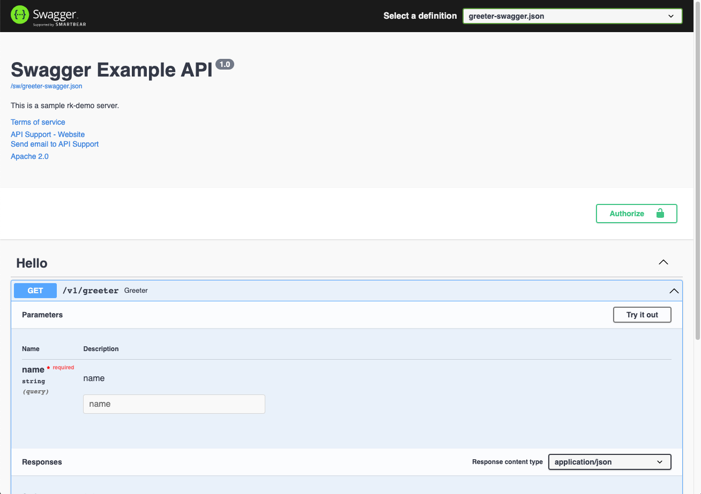
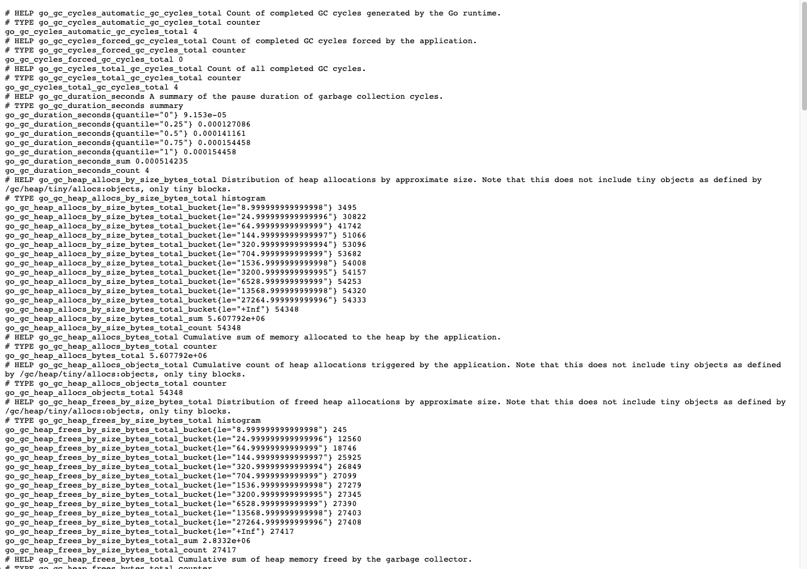
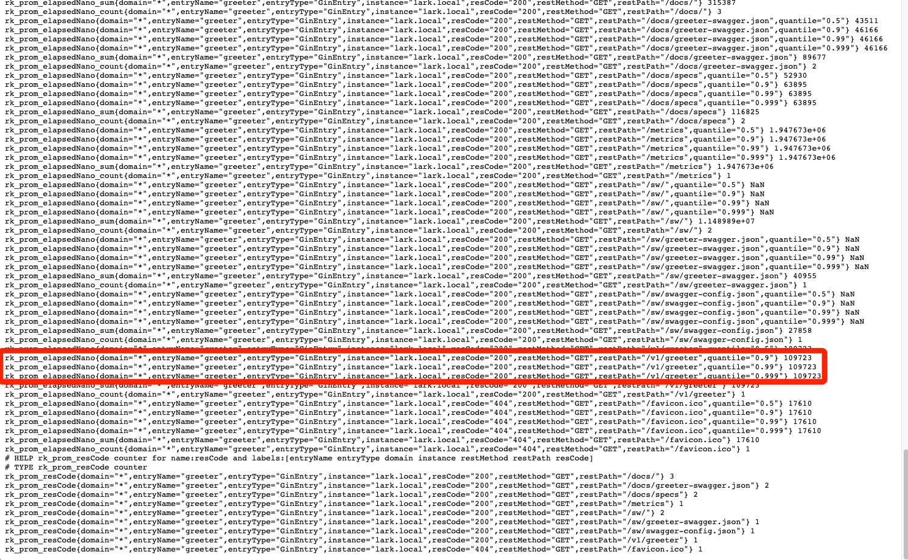

Create [gorilla/mux](https://github.com/gorilla/mux) server with rk-boot and rk-mux plugins.

## Overview
We will use rk-boot start [gorilla/mux](https://github.com/gorilla/mux) microservice and add /v1/greeter API into it.

Furthermore, we will enable bellow functionalities.

| Functionality         | Description                                                 |
|:----------------------|:------------------------------------------------------------|
| Swagger UI            | Enable Swagger UI                                           |
| API Docs UI           | Enable RapiDoc UI                                           |
| Prometheus Client     | Enable Prometheus Client                                    |
| Logging middleware    | Automatically record logs for every API calls               |
| Prometheus middleware | Automatically record prometheus metrics for every API calls |
| Meta middleware       | Automatically add requestID for every API response          |

## Install
```bash
go get github.com/rookie-ninja/rk-boot/v2
go get github.com/rookie-ninja/rk-mux
```

## 1. Create boot.yaml
```yaml
mux:
  - name: greeter
    port: 8080
    enabled: true
    sw:
      enabled: true               # Enable Swagger UI，default path: /sw
    docs:
      enabled: true               # Enable API Doc UI，default path: /docs
    prom:
      enabled: true               # Enable Prometheus Client，default path: /metrics
    middleware:
      logging:
        enabled: true
      prom:
        enabled: true
      meta:
        enabled: true
```

## 2. Create main.go
In order to generate swagger.json file, we add comments and generate swagger.json file with [swag](https://github.com/swaggo/swag) CLI.

```go
// Copyright (c) 2021 rookie-ninja
//
// Use of this source code is governed by an Apache-style
// license that can be found in the LICENSE file.
package main

import (
  "context"
  "fmt"
  "github.com/rookie-ninja/rk-boot/v2"
  "github.com/rookie-ninja/rk-mux/boot"
  "github.com/rookie-ninja/rk-mux/middleware"
  "net/http"
)

// @title RK Swagger for Mux
// @version 1.0
// @description This is a greeter service with rk-boot.
func main() {
  // Create a new boot instance.
  boot := rkboot.NewBoot()

  // Get MuxEntry
  muxEntry := rkmux.GetMuxEntry("greeter")
  // Use *mux.Router adding handler.
  muxEntry.Router.NewRoute().Path("/v1/greeter").HandlerFunc(Greeter)

  // Bootstrap
  boot.Bootstrap(context.TODO())

  boot.WaitForShutdownSig(context.TODO())
}

// Greeter handler
// @Summary Greeter service
// @Id 1
// @version 1.0
// @produce application/json
// @Param name query string true "Input name"
// @Success 200 {object} GreeterResponse
// @Router /v1/greeter [get]
func Greeter(writer http.ResponseWriter, req *http.Request) {
  rkmuxmid.WriteJson(writer, http.StatusOK, &GreeterResponse{
    Message: fmt.Sprintf("Hello %s!", req.URL.Query().Get("name")),
  })
}

type GreeterResponse struct {
  Message string
}
```

## 3.Generate swagger.json

```bash
$ swag init
```

## 4.Directory hierarchy
```bash
$ tree
.
├── boot.yaml
├── docs
│   ├── swagger.json
│   └── swagger.yaml
├── go.mod
├── go.sum
└── main.go
```

## 5.Run main.go
```bash
$ go run main.go
2022-05-09T19:13:00.327+0800    INFO    boot/mux_entry.go:687   Bootstrap muxEntry      {"eventId": "5eb9bc9a-90cf-4c0c-b918-06ec36fffbf6", "entryName": "greeter", "entryType": "MuxEntry"}
2022-05-09T19:13:00.329+0800    INFO    boot/mux_entry.go:423   SwaggerEntry: http://localhost:8080/sw/
2022-05-09T19:13:00.329+0800    INFO    boot/mux_entry.go:426   DocsEntry: http://localhost:8080/docs/
2022-05-09T19:13:00.329+0800    INFO    boot/mux_entry.go:429   PromEntry: http://localhost:8080/metrics
------------------------------------------------------------------------
endTime=2022-05-09T19:13:00.329358+08:00
startTime=2022-05-09T19:13:00.327762+08:00
elapsedNano=1596076
timezone=CST
ids={"eventId":"5eb9bc9a-90cf-4c0c-b918-06ec36fffbf6"}
app={"appName":"rk","appVersion":"local","entryName":"greeter","entryType":"MuxEntry"}
env={"arch":"amd64","domain":"*","hostname":"lark.local","localIP":"192.168.101.5","os":"darwin"}
payloads={"docsEnabled":true,"docsPath":"/docs/","muxPort":8080,"promEnabled":true,"promPath":"/metrics","promPort":8080,"swEnabled":true,"swPath":"/sw/"}
counters={}
pairs={}
timing={}
remoteAddr=localhost
operation=Bootstrap
resCode=OK
eventStatus=Ended
EOE
```

## 6.Validate
### 6.1 Swagger UI
[http://localhost:8080/sw/](http://localhost:8080/sw/)



### 6.2 API Docs UI
[http://localhost:8080/docs/](http://localhost:8080/docs/)


### 6.3 Prometheus Client
[http://localhost:8080/metrics](http://localhost:8080/metrics)



### 6.4 Send request
```bash
$ curl -vs "localhost:8080/v1/greeter?name=rk-dev"
* ...
< X-Request-Id: d95d3b00-0d10-4784-83bf-bf392cf8bd77
< X-Rk-App-Domain: *
< X-Rk-App-Name: rk
< X-Rk-App-Unix-Time: 2022-04-14T17:04:39.458193+08:00
< X-Rk-App-Version: local
< X-Rk-Received-Time: 2022-04-14T17:04:39.458193+08:00
< ...
{"Message":"Hello rk-dev!"}
```

### 6.5 API Log
rk-boot will use bellow format of logging. JSON is also supported, please see user guide for details.

```bash
------------------------------------------------------------------------
endTime=2022-05-09T19:13:21.975646+08:00
startTime=2022-05-09T19:13:21.975545+08:00
elapsedNano=101406
timezone=CST
ids={"eventId":"57ae5290-b0e6-44ac-a614-c40b03fb90d0","requestId":"57ae5290-b0e6-44ac-a614-c40b03fb90d0"}
app={"appName":"rk","appVersion":"local","entryName":"greeter","entryType":"MuxEntry"}
env={"arch":"amd64","domain":"*","hostname":"lark.local","localIP":"192.168.101.5","os":"darwin"}
payloads={"apiMethod":"GET","apiPath":"/v1/greeter","apiProtocol":"HTTP/1.1","apiQuery":"name=rk-dev","userAgent":"curl/7.64.1"}
counters={}
pairs={}
timing={}
remoteAddr=127.0.0.1:61069
operation=/v1/greeter
resCode=200
eventStatus=Ended
EOE
```

### 6.6 Prometheus Metrics
Access [http://localhost:8080/metrics](http://localhost:8080/metrics)



## _**Cheers**_
