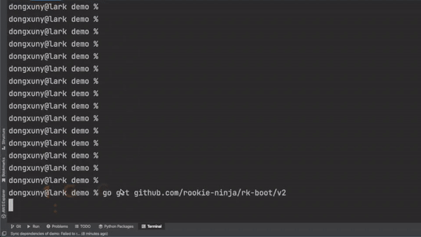

Build microservice with rk-boot and let the team take over clean and tidy code.

## Architecture

## What is it?
rk-boot is a library which can manage backend service dependencies with YAML.

Standardize, unify and simplify microservice is huge challenge when project are getting bigger. Build microservice with rk-boot and let the team take over clean and tidy code.

## Why do I want it?

* Build application with **unified project layout** at enterprise level .

* Build API with the **unified format** of logging, metrics, tracing, authorization at enterprise level.

* Make application **replace core dependencies** quickly.

* Save **learning time** of writing initializing procedure of popular frameworks and libraries.

* User defined **Entry** for customization.
