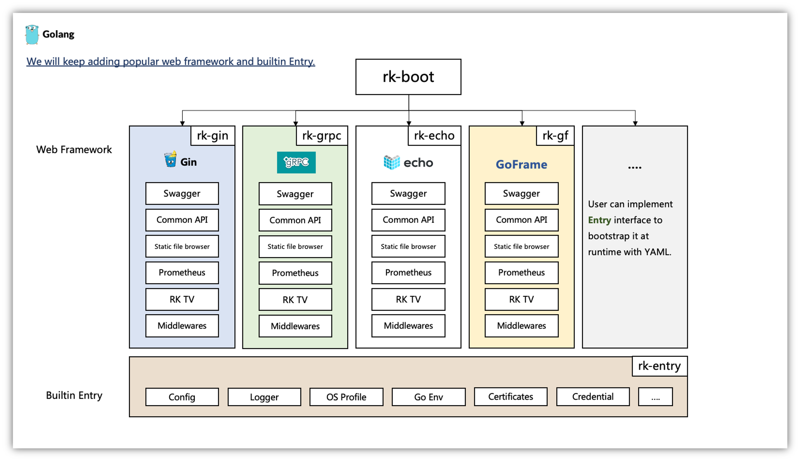

通过 rk-boot 构建干净的微服务代码。

## 架构

## rk-boot 能做什么事情？
rk-boot 能够让用户通过 YAML 文件配置开源框架，启动企业级别 Golang 后台服务。

## 为什么需要 rk-boot?
* 通过 rk-boot，构建**企业级别**的 GitHub 项目。

* 通过 rk-boot，自动添加企业级别**日志**，**监控**，**调用链**，**权限**到服务中。

* 通过 rk-boot，快速切换**核心依赖**。

* 通过 rk-boot，节省开源框架的复杂学习过程。

* 自定义 **Entry**。