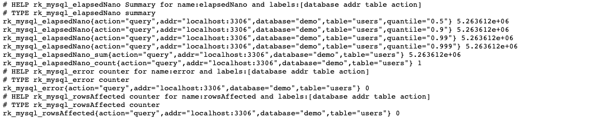

开启 prometheus 插件。

## 快速开始
### 1.安装

```bash
$ go get github.com/rookie-ninja/rk-boot/v2
$ go get github.com/rookie-ninja/rk-gin/v2
$ go get github.com/rookie-ninja/rk-db/mysql
```

### 2.创建 boot.yaml
```yaml
---
gin:
  - name: user-service
    port: 8080
    enabled: true
    prom:
      enabled: true
mysql:
  - name: demo-db
    enabled: true
    addr: "localhost:3306"
    database:
      - name: demo
        plugins:
          prom: enabled         # Enable prometheus plugin
        autoCreate: true
```

### 3.创建 main.go
```go
package main

import (
	"context"
	"github.com/gin-gonic/gin"
	"github.com/rookie-ninja/rk-boot/v2"
	"github.com/rookie-ninja/rk-db/mysql"
	"github.com/rookie-ninja/rk-entry/v2/middleware"
	"github.com/rookie-ninja/rk-gin/v2/boot"
	"github.com/rookie-ninja/rk-gin/v2/middleware/context"
	"gorm.io/gorm"
	"net/http"
	"time"
)

var userDb *gorm.DB

func main() {
	boot := rkboot.NewBoot()

	boot.Bootstrap(context.TODO())

	// Auto migrate database and init global userDb variable
	mysqlEntry := rkmysql.GetMySqlEntry("demo-db")
	userDb = mysqlEntry.GetDB("demo")

	if !userDb.DryRun {
		userDb.AutoMigrate(&User{})
	}

	// Register APIs
	ginEntry := rkgin.GetGinEntry("user-service")
	
	// Register collector to prometheus
	// User can create own prometheus.Registry
	mysqlEntry.RegisterPromMetrics(ginEntry.PromEntry.Registry)

	ginEntry.Router.GET("/v1/user", ListUsers)

	boot.WaitForShutdownSig(context.TODO())
}

// *************************************
// *************** Model ***************
// *************************************

type Base struct {
	CreatedAt time.Time      `yaml:"-" json:"-"`
	UpdatedAt time.Time      `yaml:"-" json:"-"`
	DeletedAt gorm.DeletedAt `yaml:"-" json:"-" gorm:"index"`
}

type User struct {
	Base
	Id   int    `yaml:"id" json:"id" gorm:"primaryKey"`
	Name string `yaml:"name" json:"name"`
}

func ListUsers(ctx *gin.Context) {
	userList := make([]User, 0)

	dbCtx := context.WithValue(ctx, rkmid.LoggerKey.String(), rkginctx.GetLogger(ctx))
	res := userDb.WithContext(dbCtx).Find(&userList)

	if res.Error != nil {
		ctx.JSON(http.StatusInternalServerError, res.Error)
		return
	}
	ctx.JSON(http.StatusOK, userList)
}
```

### 3.运行
```bash
$ go run main.go

2022-09-19T01:05:01.861+0800    INFO    mysql/boot.go:378       Bootstrap MySqlEntry    {"eventId": "a568e408-38e8-4279-9701-2e58a6f73c36", "entryName": "demo-db", "entryType": "MySqlEntry"}
2022-09-19T01:05:01.861+0800    INFO    mysql/boot.go:497       Creating database [demo]
2022-09-19T01:05:01.880+0800    INFO    mysql/boot.go:519       Creating database [demo] successs
2022-09-19T01:05:01.880+0800    INFO    mysql/boot.go:522       Connecting to database [demo]
2022-09-19T01:05:01.887+0800    INFO    mysql/boot.go:540       Connecting to database [demo] success
2022-09-19T01:05:01.887+0800    INFO    boot/gin_entry.go:672   Bootstrap GinEntry      {"eventId": "a568e408-38e8-4279-9701-2e58a6f73c36", "entryName": "user-service", "entryType": "GinEntry"}
2022-09-19T01:05:01.887+0800    INFO    boot/gin_entry.go:432   PromEntry: http://localhost:8080/metrics
```

### 4.验证
- 发送请求

```bash
$ curl localhost:8080/v1/user
```

- 访问 Prometheus 客户端

[http://localhost:8080/metrics](http://localhost:8080/metrics)



