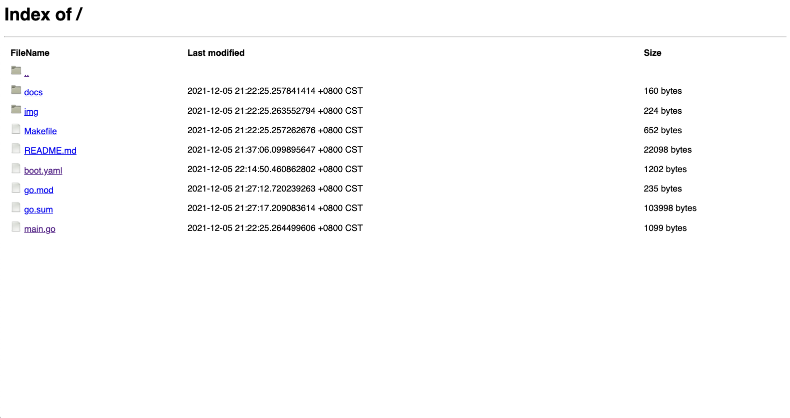

如何通过网页浏览和下载静态文件?

## 概述
rk-boot 提供了一个方便的方法，让用户快速实现通过网页浏览和下载静态文件的功能。

目前，rk-boot 支持如下文件源。如果用户希望支持更多的文件源，可以通过实现 http.FileSystem 接口来实现。
- 本地文件系统
- embed.FS

## 快速开始
### 1.安装

```bash
$ go get github.com/rookie-ninja/rk-boot/v2
$ go get github.com/rookie-ninja/rk-echo
```

### 2.创建 boot.yaml
```yaml
---
echo:
  - name: greeter
    port: 8080
    enabled: true
    static:
      enabled: true
      path: "/static"
      sourceType: local
      sourcePath: "."
```

### 3.创建 main.go
```go
package main

import (
	"context"
	"github.com/rookie-ninja/rk-boot/v2"
	_ "github.com/rookie-ninja/rk-echo/boot"
)

func main() {
	// Create a new boot instance.
	boot := rkboot.NewBoot()

	// Bootstrap
	boot.Bootstrap(context.TODO())

	boot.WaitForShutdownSig(context.TODO())
}
```

### 4.访问自定义 Path
> [http://localhost:8080/static](http://localhost:8080/static)



### _**Cheers**_

