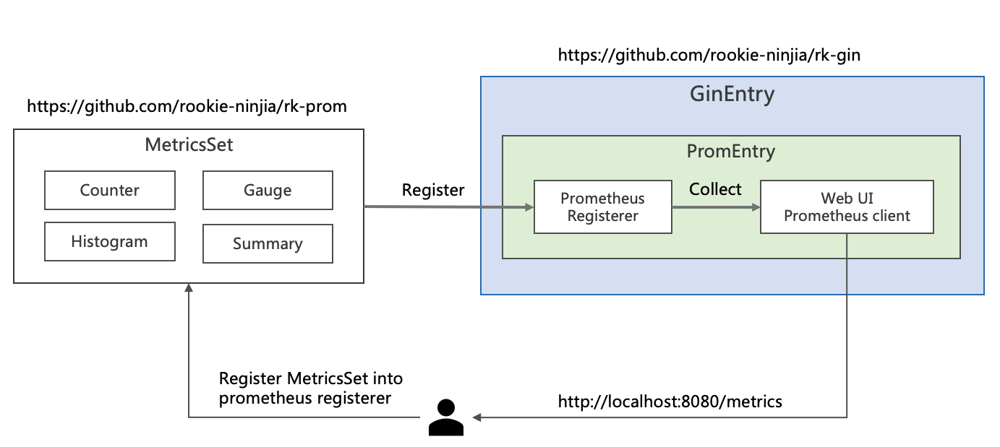
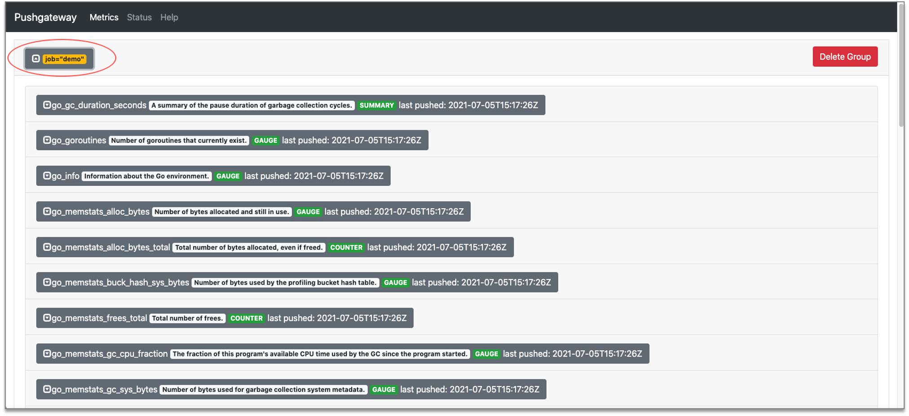

Enable Prometheus client

## Install
```bash
go get github.com/rookie-ninja/rk-boot/v2
go get github.com/rookie-ninja/rk-gf
```

## Prometheus options
| options                        | description                                    | type    | default  |
|--------------------------------|------------------------------------------------|---------|----------|
| gf.prom.enabled                | Enable prometheus client                       | boolean | false    |
| gf.prom.path                 | Prometheus web path                            | string  | /metrics |
| gf.prom.pusher.enabled       | Enable prometheus pusher                       | bool    | false    |
| gf.prom.pusher.jobName       | Job name metrics                               | string  | ""       |
| gf.prom.pusher.remoteAddress | Pushgateway address, http://x.x.x.x or x.x.x.x | string  | ""       |
| gf.prom.pusher.intervalMs    | Interval in milliseconds                       | string  | 1000     |
| gf.prom.pusher.basicAuth     | Basic auth of Pushgateway. Scheme：[user:pass]  | string  | ""       |
| gf.prom.pusher.certEntry     | Name of rkentry.CertEntry                      | string  | ""       |

## Quick start
### 1.Create boot.yaml
```yaml
---
gf:
  - name: greeter
    port: 8080
    enabled: true
    prom:
      enabled: true                                        # Optional, default: false
#      path: ""                                            # Optional, default: "/metrics"
#      pusher:
#        enabled: false                                    # Optional, default: false
#        jobName: "greeter-pusher"                         # Required
#        remoteAddress: "localhost:9091"                   # Required
#        basicAuth: "user:pass"                            # Optional, default: ""
#        intervalMs: 10000                                 # Optional, default: 1000
#        certEntry: my-cert                                # Optional, default: "", reference of cert entry declared above
```

### 2.Create main.go
```go
package main

import (
	"context"
    "github.com/rookie-ninja/rk-boot/v2"
	_ "github.com/rookie-ninja/rk-gf/boot"
)

// Application entrance.
func main() {
	// Create a new boot instance.
	boot := rkboot.NewBoot()

	// Bootstrap
	boot.Bootstrap(context.Background())

	// Wait for shutdown sig
	boot.WaitForShutdownSig(context.Background())
}
```

### 3.Validate
> Validate
>
> [http://localhost:8080/metrics](http://localhost:8080/metrics)


### _**Cheers**_


### 4.Add metrics into Prometheus



| Name                                                                                                    | Description                                                                        |
|---------------------------------------------------------------------------------------------------------|------------------------------------------------------------------------------------|
| [MetricsSet](https://github.com/rookie-ninja/rk-prom/blob/master/metrics_set.go)                        | Register Counter，Gauge，Histogram and Summary through MetricsSet                    |
| [Prometheus Registerer](https://github.com/prometheus/client_golang/blob/master/prometheus/registry.go) | Prometheus will manage Counter，Gauge，Histogram and Summary through Registrerer 来管理 |
| [Prometheus Counter](https://prometheus.io/docs/concepts/metric_types/#counter)                         | Counter, increase only                                                             |
| [Prometheus Gauge](https://prometheus.io/docs/concepts/metric_types/#gauge)                             | Gauge                                                                              |
| [Prometheus Histogram](https://prometheus.io/docs/concepts/metric_types/#histogram)                     | Histogram                                                                          |
| [Prometheus Summary](https://prometheus.io/docs/concepts/metric_types/#summary)                         | Summary                                                                            |
| Prometheus Namespace                                                                                    | Format: namespace_subSystem_metricsName                                            |
| Prometheus SubSystem                                                                                    | Format: namespace_subSystem_metricsName                                            |

```go
package main

import (
  "context"
  "fmt"
  "github.com/gogf/gf/v2/net/ghttp"
  "github.com/rookie-ninja/rk-boot/v2"
  "github.com/rookie-ninja/rk-entry/v2/middleware/prom"
  "github.com/rookie-ninja/rk-gf/boot"
  "net/http"
)

// Application entrance.
func main() {
  // Create a new boot instance.
  boot := rkboot.NewBoot()

  // Register handler
  entry := rkgf.GetGfEntry("greeter")

  set := rkmidprom.NewMetricsSet("rk", "demo", entry.PromEntry.Registerer)

  // Register counter, gauge, histogram, summary
  set.RegisterCounter("my_counter", "label")
  set.RegisterGauge("my_gauge", "label")
  set.RegisterHistogram("my_histogram", []float64{}, "label")
  set.RegisterSummary("my_summary", rkmidprom.SummaryObjectives, "label")

  // Increase counter, gauge, histogram, summary with label value
  set.GetCounterWithValues("my_counter", "value").Inc()
  set.GetGaugeWithValues("my_gauge", "value").Add(1.0)
  set.GetHistogramWithValues("my_histogram", "value").Observe(0.1)
  set.GetSummaryWithValues("my_summary", "value").Observe(0.1)

  // Bootstrap
  boot.Bootstrap(context.TODO())

  boot.WaitForShutdownSig(context.TODO())
}
```

### 5.Validate
> Validate
>
> [http://localhost:8080/metrics](http://localhost:8080/metrics)


### _**Cheers**_


### 6.Push to Pushgateway
```yaml
---
gf:
  - name: greeter
    port: 8080
    enabled: true
    prom:
      enabled: true                         # Optional, default: false
      pusher:
        enabled : true                      # Optional, default: false
        jobName: "demo"                     # Required
        remoteAddress: "localhost:9091"     # Required
        intervalMs: 2000                    # Optional, default: 1000
#        certEntry: my-cert                 # Optional, default: "", reference of cert entry declared above
```

> Start pushgateway locally
```bash
$ docker run -p 9091:9091 prom/pushgateway
```

> [http://localhost:9091](http://localhost:9091)



### _**Cheers**_
