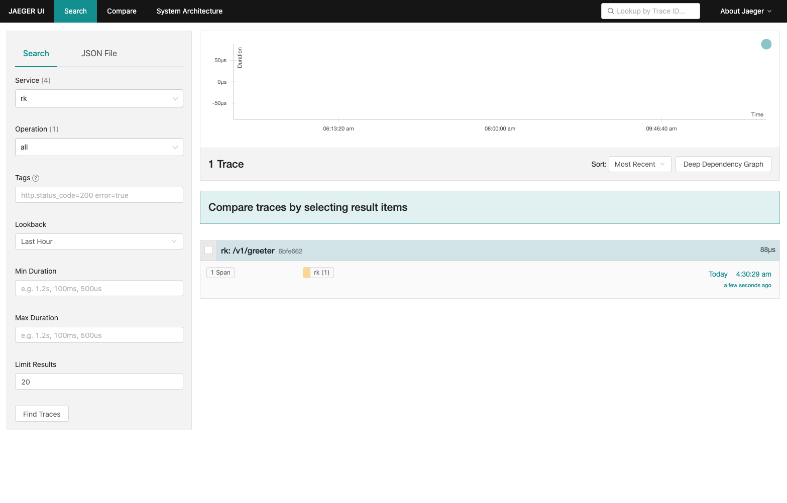

启动调用链中间件。

## 安装
```bash
go get github.com/rookie-ninja/rk-boot/v2
go get github.com/rookie-ninja/rk-gin/v2
```

## 选项
| 名字                                                      | 描述                      | 类型       | 默认值                              |
|---------------------------------------------------------|-------------------------|----------|----------------------------------|
| gin.middleware.trace.enabled                            | 启动调用链拦截器                | boolean  | false                            |
| gin.middleware.trace.ignore                             | 局部选项，忽略 API 路径          | []string | []                               |
| gin.middleware.trace.exporter.file.enabled              | 启动文件输出                  | boolean  | false                            |
| gin.middleware.trace.exporter.file.outputPath           | 输出文件路径                  | string   | stdout                           |
| gin.middleware.trace.exporter.jaeger.agent.enabled      | jaeger agent 作为数据输出     | boolean  | false                            |
| gin.middleware.trace.exporter.jaeger.agent.host         | jaeger agent 地址         | string   | localhost                        |
| gin.middleware.trace.exporter.jaeger.agent.port         | jaeger agent 端口         | int      | 6831                             |
| gin.middleware.trace.exporter.jaeger.collector.enabled  | jaeger collector 作为数据输出 | boolean  | false                            |
| gin.middleware.trace.exporter.jaeger.collector.endpoint | jaeger collector 地址     | string   | http://localhost:16368/api/trace |
| gin.middleware.trace.exporter.jaeger.collector.username | jaeger collector 用户名    | string   | ""                               |
| gin.middleware.trace.exporter.jaeger.collector.password | jaeger collector 密码     | string   | ""                               |

## 快速开始
### 1.创建 boot.yaml
```yaml
---
gin:
  - name: greeter
    port: 8080
    enabled: true
    middleware:
      trace:
        enabled: true
        exporter:
          file:
            enabled: true
            outputPath: "stdout"
#        ignore: [""]
#          jaeger:
#            agent:
#              enabled: false
#              host: ""
#              port: 0
#            collector:
#              enabled: true
#              endpoint: ""
#              username: ""
#              password: ""

```

### 2.创建 main.go
```go
package main

import (
  "context"
  "fmt"
  "github.com/gin-gonic/gin"
  "github.com/rookie-ninja/rk-boot/v2"
  "github.com/rookie-ninja/rk-gin/v2/boot"
  "net/http"
)

func main() {
  // Create a new boot instance.
  boot := rkboot.NewBoot()

  // Register handler
  entry := rkgin.GetGinEntry("greeter")
  entry.Router.GET("/v1/greeter", Greeter)

  // Bootstrap
  boot.Bootstrap(context.TODO())

  boot.WaitForShutdownSig(context.TODO())
}

func Greeter(ctx *gin.Context) {
  ctx.JSON(http.StatusOK, &GreeterResponse{
    Message: fmt.Sprintf("Hello %s!", ctx.Query("name")),
  })
}

type GreeterResponse struct {
  Message string
}
```

### 3.验证
> 发送请求

```bash
$ curl -X GET "localhost:8080/v1/greeter?name=rk-dev"
{"Message":"Hello rk-dev!"}
```

```json
{
  "Name": "/v1/greeter",
  "SpanContext": {
    "TraceID": "507aaae07729a9f7cae7ec25ee7f0ede",
    "SpanID": "ea556bd79f2f2732",
    "TraceFlags": "01",
    "TraceState": "",
    "Remote": false
  },
  "Parent": {
    "TraceID": "00000000000000000000000000000000",
    "SpanID": "0000000000000000",
    "TraceFlags": "00",
    "TraceState": "",
    "Remote": true
  },
  "SpanKind": 2,
  "StartTime": "2022-04-15T23:28:34.054496+08:00",
  "EndTime": "2022-04-15T23:28:34.054594239+08:00",
  "Attributes": [
    ...
    {
      "Key": "http.status_code",
      "Value": {
        "Type": "INT64",
        "Value": 200
      }
    }
  ],
  ...
  "Resource": [
    {
      "Key": "service.entryName",
      "Value": {
        "Type": "STRING",
        "Value": "greeter"
      }
    },
    {
      "Key": "service.entryType",
      "Value": {
        "Type": "STRING",
        "Value": "GinEntry"
      }
    },
  ],
  "InstrumentationLibrary": {
    "Name": "greeter",
    "Version": "semver:1.4.0",
    "SchemaURL": ""
  }
}
```

### _**Cheers**_


### 4.输出到文件
> 输出到文件的时候，会有几秒的延迟。

```yaml
---
gin:
  - name: greeter
    port: 8080
    enabled: true
    middleware:
      trace:
        enabled: true
        exporter:
          file:
            enabled: true
            outputPath: "logs/tracing.log"
```

### _**Cheers**_


### 5.输出到 jaeger

> 本地启动 [jaeger-all-in-one](https://www.jaegertracing.io/docs/1.23/getting-started/)
> ```bash
> $ docker run -d --name jaeger \
>     -e COLLECTOR_ZIPKIN_HOST_PORT=:9411 \
>     -p 5775:5775/udp \
>     -p 6831:6831/udp \
>     -p 6832:6832/udp \
>     -p 5778:5778 \
>     -p 16686:16686 \
>     -p 14268:14268 \
>     -p 14250:14250 \
>     -p 9411:9411 \
>     jaegertracing/all-in-one:1.23
> ```

```yaml
---
gin:
  - name: greeter
    port: 8080
    enabled: true
    middleware:
      trace:
        enabled: true
        exporter:
          jaeger:
            agent:
              enabled: true
#              host: ""                                        # Optional, default: localhost
#              port: 0                                         # Optional, default: 6831
#            collector:
#              enabled: true                                   # Optional, default: false
#              endpoint: ""                                    # Optional, default: http://localhost:14268/api/traces
#              username: ""                                    # Optional, default: ""
#              password: ""                                    # Optional, default: ""
```

> Jaeger:
> 
> [http://localhost:16686/](http://localhost:16686/)



### _**Cheers**_
