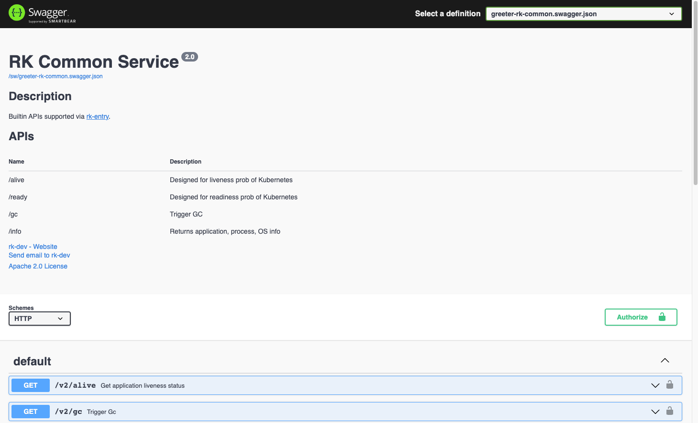

启动 Common API。

## 概述
通用 API 内嵌到了启动器里，不需要额外的实现。

| 路径           | 描述                  |
|--------------|---------------------|
| /rk/v1/alive | 主要用于 K8S liveness。  |
| /rk/v1/ready | 主要用于 K8S readiness。 |
| /rk/v1/info  | 返回 Application 信息。  |
| /rk/v1/gc    | 触发 GC。              |

## 安装
```shell
go get github.com/rookie-ninja/rk-boot/v2
go get github.com/rookie-ninja/rk-grpc/v2
```

## 通用 API 选项
| 名字                            | 描述              | 类型      | 默认值    |
|-------------------------------|-----------------|---------|--------|
| grpc.commonService.enabled    | 启动 Common API   | boolean | false  |
| grpc.commonService.pathPrefix | Common API 路径前缀 | string  | /rk/v1 |

## 快速开始
### 1.创建 boot.yaml
```yaml
---
grpc:
  - name: greeter
    port: 8080
    enabled: true
    commonService:
      enabled: true
#      pathPrefix: ""
```

### 2.创建 main.go
```go
package main

import (
	"context"
    "github.com/rookie-ninja/rk-boot/v2"
    _ "github.com/rookie-ninja/rk-grpc/v2/boot"
)

// Application entrance.
func main() {
	// Create a new boot instance.
	boot := rkboot.NewBoot()

	// Bootstrap
	boot.Bootstrap(context.Background())

	// Wait for shutdown sig
	boot.WaitForShutdownSig(context.Background())
}
```

### 3.验证
```bash
$ curl localhost:8080/rk/v1/ready
{
  "ready": true
}
```

### _**Cheers**_


### 4.启动 swagger UI
```yaml
---
grpc:
  - name: greeter
    port: 8080
    enabled: true
    commonService:
      enabled: true
    sw:
      enabled: true
```

> 验证
>
> [http://localhost:8080/sw](http://localhost:8080/sw)



### _**Cheers**_


