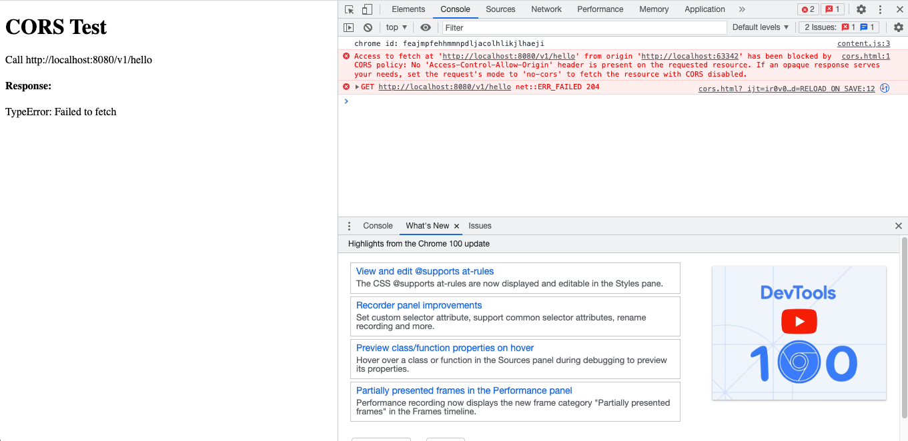

## 安装
```bash
go get github.com/rookie-ninja/rk-boot/v2
go get github.com/rookie-ninja/rk-grpc/v2
```

## CORS 选项
| 名字                                    | 描述                                           | 类型       | 默认值                  |
|---------------------------------------|----------------------------------------------|----------|----------------------|
| grpc.middleware.cors.enabled          | 启动 CORS 中间件                                  | boolean  | false                |
| grpc.middleware.cors.ignore           | 局部选项，忽略 API 路径                               | []string | []                   |
| grpc.middleware.cors.allowOrigins     | 可通过验证的 Origin 地址。                            | []string | *                    |
| grpc.middleware.cors.allowMethods     | 可通过的 http method, 会包含在 OPTIONS 请求的 Header 中。 | []string | All http methods     |
| grpc.middleware.cors.allowHeaders     | 可通过的 http header, 会包含在 OPTIONS 请求的 Header 中。 | []string | Headers from request |
| grpc.middleware.cors.allowCredentials | 会包含在 OPTIONS 请求的 Header 中。                   | bool     | false                |
| grpc.middleware.cors.exposeHeaders    | 会包含在 OPTIONS 请求的 Header 中的 Header。           | []string | ""                   |
| grpc.middleware.cors.maxAge           | 会包含在 OPTIONS 请求的 Header 中的 MaxAge。           | int      | 0                    |

## 快速开始
### 1.创建并编译 protocol buffer
[使用 buf 编译 protocol buf](../buf)

### 2.创建 boot.yaml
```yaml
---
grpc:
  - name: greeter
    port: 8080
    enabled: true
    enableRkGwOption: true
    middleware:
      cors:
        enabled: true
        allowOrigins:
          - "http://localhost:*"
#        ignore: [""]
#        allowCredentials: false
#        allowHeaders: []
#        allowMethods: []
#        exposeHeaders: []
#        maxAge: 0
```

### 3.创建 main.go
```go
package main

import (
  "context"
  "github.com/rookie-ninja/rk-boot/v2"
  "github.com/rookie-ninja/rk-demo/api/gen/v1"
  "github.com/rookie-ninja/rk-grpc/v2/boot"
  "google.golang.org/grpc"
)

func main() {
  boot := rkboot.NewBoot()

  // register grpc
  entry := rkgrpc.GetGrpcEntry("greeter")
  entry.AddRegFuncGrpc(registerGreeter)
  entry.AddRegFuncGw(greeter.RegisterGreeterHandlerFromEndpoint)

  // Bootstrap
  boot.Bootstrap(context.TODO())

  // Wait for shutdown sig
  boot.WaitForShutdownSig(context.TODO())
}

func registerGreeter(server *grpc.Server) {
  greeter.RegisterGreeterServer(server, &GreeterServer{})
}

type GreeterServer struct{}

func (server *GreeterServer) Hello(ctx context.Context, _ *greeter.HelloRequest) (*greeter.HelloResponse, error) {
  return &greeter.HelloResponse{
    Message: "hello!",
  }, nil
}
```

### 4.创建 cors.html
```html
<!DOCTYPE html>
<html>
<body>

<h1>CORS Test</h1>

<p>Call http://localhost:8080/v1/greeter</p>

<script type="text/javascript">
    window.onload = function() {
        var apiUrl = 'http://localhost:8080/v1/hello';
        fetch(apiUrl).then(response => response.json()).then(data => {}).catch(err => {
            document.getElementById("res").innerHTML = err
        });
    };
</script>

<h4>Response: </h4>
<p id="res"></p>

</body>
</html>
```

### 5.验证
打开 cors.html


### 6.被拦截的 CORS
将 gin.middleware.cors.allowOrigins 设置成 http://localhost:8080。

```yaml
---
grpc:
  - name: greeter
    port: 8080
    enabled: true
    enableRkGwOption: true
    middleware:
      cors:
        enabled: true
        allowOrigins:
          - "http://localhost:8080"
```



### _**Cheers**_
