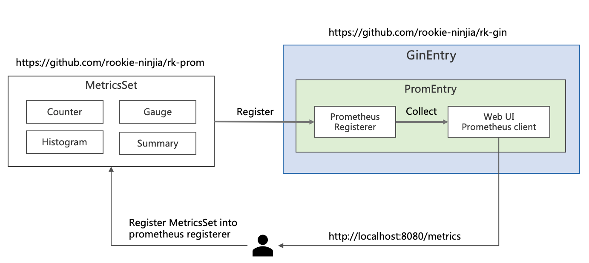

启动 Prometheus 客户端。

## 安装
```bash
go get github.com/rookie-ninja/rk-boot/v2
go get github.com/rookie-ninja/rk-grpc/v2
```

## Prometheus 选项
| 名字                            | 描述                                          | 类型 | 默认值 |
|-------------------------------|---------------------------------------------| ------ | ------ |
| grpc.prom.enabled              | 启动 prometheus                               | boolean | false |
| grpc.prom.path                 | Prometheus Web 路径                           | string | /metrics |
| grpc.prom.pusher.enabled       | 启动 prometheus pusher                        | bool | false |
| grpc.prom.pusher.jobName       | JobName 将会以标签的形式添加到监控指标，并推送到远程 pushgateway  | string | "" |
| grpc.prom.pusher.remoteAddress | Pushgateway 远程地址, http://x.x.x.x 或者 x.x.x.x | string | "" |
| grpc.prom.pusher.intervalMs    | 推送间隔（毫秒）                                    | string | 1000 |
| grpc.prom.pusher.basicAuth     | 远程 Pushgateway 的 Basic auth。 格式：[user:pass] | string | "" |
| grpc.prom.pusher.certEntry     | rkentry.CertEntry 名称，请参考高级指南                | string | "" |

## 快速开始
### 1.创建 boot.yaml
```yaml
---
grpc:
  - name: greeter
    port: 8080
    enabled: true
    enableRkGwOption: true
    prom:
      enabled: true                                        # Optional, default: false
#      path: ""                                            # Optional, default: "/metrics"
#      pusher:
#        enabled: false                                    # Optional, default: false
#        jobName: "greeter-pusher"                         # Required
#        remoteAddress: "localhost:9091"                   # Required
#        basicAuth: "user:pass"                            # Optional, default: ""
#        intervalMs: 10000                                 # Optional, default: 1000
#        certEntry: my-cert                                # Optional, default: "", reference of cert entry declared above
```

### 2.创建 main.go
```go
package main

import (
	"context"
    "github.com/rookie-ninja/rk-boot/v2"
	_ "github.com/rookie-ninja/rk-grpc/v2/boot"
)

// Application entrance.
func main() {
	// Create a new boot instance.
	boot := rkboot.NewBoot()

	// Bootstrap
	boot.Bootstrap(context.Background())

	// Wait for shutdown sig
	boot.WaitForShutdownSig(context.Background())
}
```

### 3.验证
> 验证
>
> [http://localhost:8080/metrics](http://localhost:8080/metrics)


### _**Cheers**_


### 4.Prometheus 客户端中添加监控
> 我们需要先了解 Prometheus 中的如下概念。



| 名字 | 详情 |
| ---- | ---- |
| [MetricsSet](https://github.com/rookie-ninja/rk-prom/blob/master/metrics_set.go) | RK 自定义的结构，通过 MetricsSet 注册 Prometheus 的 Counter，Gauge，Histogram 和 Summary |
| [Prometheus Registerer](https://github.com/prometheus/client_golang/blob/master/prometheus/registry.go) | Prometheus 会通过 Registrerer 来管理 Counter，Gauge，Histogram 和 Summary  |
| [Prometheus Counter](https://prometheus.io/docs/concepts/metric_types/#counter) | Counter 是一个累积度量，表示单个单调增加的计数器，其值只能增加或重置为零 |
| [Prometheus Gauge](https://prometheus.io/docs/concepts/metric_types/#gauge) | Gauge 值可以随意加减 |
| [Prometheus Histogram](https://prometheus.io/docs/concepts/metric_types/#histogram) | Histogram 进行采样（通常是请求持续时间或响应大小之类的内容）并将它们计算在可配置的桶中，同时还提供所有观测值的总和 |
| [Prometheus Summary](https://prometheus.io/docs/concepts/metric_types/#summary) | 与 Histogram 类似，摘要样本观察（通常是请求持续时间和响应大小之类的东西） |
| Prometheus Namespace | Prometheus 监控名格式： namespace_subSystem_metricsName |
| Prometheus SubSystem | Prometheus 监控名格式： namespace_subSystem_metricsName |

```go
package main

import (
  "context"
  "github.com/rookie-ninja/rk-boot/v2"
  "github.com/rookie-ninja/rk-entry/v2/middleware/prom"
  "github.com/rookie-ninja/rk-grpc/v2/boot"
  "google.golang.org/grpc"
)

func main() {
  boot := rkboot.NewBoot()

  // register grpc
  entry := rkgrpc.GetGrpcEntry("greeter")

  set := rkmidprom.NewMetricsSet("rk", "demo", entry.PromEntry.Registerer)

  // Register counter, gauge, histogram, summary
  set.RegisterCounter("my_counter", "label")
  set.RegisterGauge("my_gauge", "label")
  set.RegisterHistogram("my_histogram", []float64{}, "label")
  set.RegisterSummary("my_summary", rkmidprom.SummaryObjectives, "label")

  // Increase counter, gauge, histogram, summary with label value
  set.GetCounterWithValues("my_counter", "value").Inc()
  set.GetGaugeWithValues("my_gauge", "value").Add(1.0)
  set.GetHistogramWithValues("my_histogram", "value").Observe(0.1)
  set.GetSummaryWithValues("my_summary", "value").Observe(0.1)

  // Bootstrap
  boot.Bootstrap(context.TODO())

  // Wait for shutdown sig
  boot.WaitForShutdownSig(context.TODO())
}
```

### 5.验证
> 验证
>
> [http://localhost:8080/metrics](http://localhost:8080/metrics)


### _**Cheers**_


### 6.推送到 Pushgateway
在 boot.yaml 中启动 pusher。
```yaml
---
grpc:
  - name: greeter
    port: 8080
    enabled: true
    enableRkGwOption: true
    prom:
      enabled: true                         # Optional, default: false
      pusher:
        enabled : true                      # Optional, default: false
        jobName: "demo"                     # Required
        remoteAddress: "localhost:9091"     # Required
        intervalMs: 2000                    # Optional, default: 1000
#        certEntry: my-cert                 # Optional, default: "", reference of cert entry declared above
```

> 在本地启动 pushgateway
```bash
$ docker run -p 9091:9091 prom/pushgateway
```

> 在本地 pushgateway 中验证
>
> [http://localhost:9091](http://localhost:9091)


### _**Cheers**_
