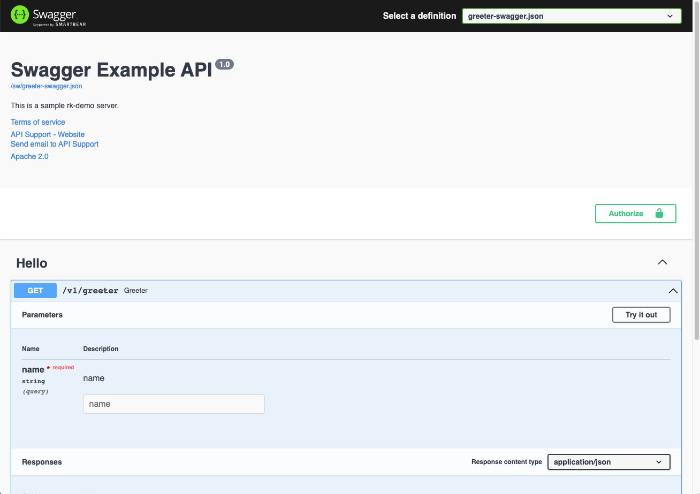

Enable Swagger UI.

## Prerequisite
We will use [swag](https://github.com/swaggo/swag) to generate swagger UI config files.

> Through [swag](https://github.com/swaggo/swag)
```bash
$ go get -u github.com/swaggo/swag/cmd/swag
```

## Install
```bash
go get github.com/rookie-ninja/rk-boot/v2
go get github.com/rookie-ninja/rk-mux
```

## Swagger options
| name             | description                                     | type     | default value |
|------------------|-------------------------------------------------|----------|---------------|
| mux.sw.enabled  | Enable Swagger UI                               | boolean  | false         |
| mux.sw.path     | Path of Swagger Web UI                          | string   | sw            |
| mux.sw.jsonPath | Path Swagger config（swagger.json）file           | string   | ""            |
| mux.sw.headers  | Headers returned by server, format: [key:value] | []string | []            |

## Quick start
### 1.Create boot.yaml
> rk-boot will search docs/, api/gen/v1/ folder for swagger JSON file
>
> If swagger JSON located at other location，**mux.sw.jsonPath** needs to be configured

```yaml
---
mux:
  - name: greeter
    port: 8080
    enabled: true
    sw:
      enabled: true
#      jsonPath: ""
#      path: "sw"
#      headers: []
```

### 2.Create main.go
> In order to create Swagger JSON file with swag，comments needs to be added in codes
>
> Please refer to [swag](https://github.com/swaggo/swag)

```go
// Copyright (c) 2021 rookie-ninja
//
// Use of this source code is governed by an Apache-style
// license that can be found in the LICENSE file.
package main

import (
  "context"
  _ "embed"
  "fmt"
  "github.com/rookie-ninja/rk-boot/v2"
  "github.com/rookie-ninja/rk-mux/boot"
  "github.com/rookie-ninja/rk-mux/middleware"
  "net/http"
)

// @title RK Swagger for Mux
// @version 1.0
// @description This is a greeter service with rk-boot.
func main() {
  // Create a new boot instance.
  boot := rkboot.NewBoot()

  // Get MuxEntry
  muxEntry := rkmux.GetMuxEntry("greeter")
  // Use *mux.Router adding handler.
  muxEntry.Router.NewRoute().Path("/v1/greeter").HandlerFunc(Greeter)

  // Bootstrap
  boot.Bootstrap(context.TODO())

  boot.WaitForShutdownSig(context.TODO())
}

// Greeter handler
// @Summary Greeter service
// @Id 1
// @version 1.0
// @produce application/json
// @Param name query string true "Input name"
// @Success 200 {object} GreeterResponse
// @Router /v1/greeter [get]
func Greeter(writer http.ResponseWriter, req *http.Request) {
  rkmuxmid.WriteJson(writer, http.StatusOK, &GreeterResponse{
    Message: fmt.Sprintf("Hello %s!", req.URL.Query().Get("name")),
  })
}

type GreeterResponse struct {
  Message string
}
```

### 3.Generate swagger config file
```bash
$ swag init

# swagger.json, swagger.yaml, docs.go files will be generated under ./docs folder.
$ tree
.
├── boot.yaml
├── docs
│   ├── docs.go
│   ├── swagger.json
│   └── swagger.yaml
├── go.mod
├── go.sum
└── main.go

1 directory, 7 files
```

### 4.Validate
> **Swagger:** [http://localhost:8080/sw](http://localhost:8080/sw)



### _**Cheers**_
