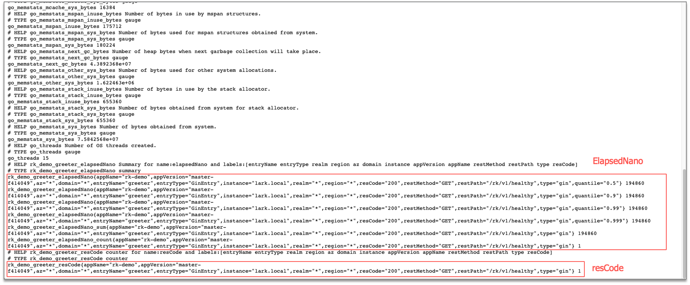

启动 Prometheus 中间件。

## 安装
```bash
go get github.com/rookie-ninja/rk-boot/v2
go get github.com/rookie-ninja/rk-fiber
```

## 选项
| 名字                            | 描述                | 类型       | 默认值   |
|-------------------------------|-------------------|----------|-------|
| fiber.middleware.prom.enabled | 启动 Prometheus 中间件 | boolean  | false |
| fiber.middleware.prom.ignore  | 局部选项，忽略 API 路径    | []string | []    |

## 概念
Prometheus 中间件会默认记录如下监控。

| 监控项         | 数据类型    | 详情             |
|-------------|---------|----------------|
| elapsedNano | Summary | RPC 耗时         |
| resCode     | Counter | 基于 RPC 返回码的计数器 |

上述三项监控，都有如下的标签。

| 标签         | 详情                                                                                                |
|------------|---------------------------------------------------------------------------------------------------|
| entryName  | Entry 名称                                                                                          |
| entryType  | Entry 类型                                                                                          |
| domain     | 环境变量: DOMAIN, eg: prod                                                                            |
| instance   | 本地 Hostname                                                                                       |
| restMethod | eg: GET                                                                                           |
| restPath   | eg: /rk/v1/alive                                                                                  |
| resCode    | 返回码, eg: 200                                                                                      |

例子

```bash
rk_prom_elapsedNano{domain="*",entryName="greeter",entryType="FiberEntry",instance="lark.local",resCode="200",restMethod="GET",restPath="/v1/greeter",quantile="0.5"} 88645
...
rk_prom_resCode{domain="*",entryName="greeter",entryType="FiberEntry",instance="lark.local",resCode="200",restMethod="GET",restPath="/v1/greeter"} 1
```

## 快速开始
### 1.创建 boot.yaml
```yaml
---
fiber:
  - name: greeter
    port: 8080
    enabled: true
    prom:
      enabled : true
    middleware:
      prom:
        enabled: true
#        ignore: [""]
```

### 2.创建 main.go
```go
// Copyright (c) 2021 rookie-ninja
//
// Use of this source code is governed by an Apache-style
// license that can be found in the LICENSE file.

package main

import (
  "context"
  "fmt"
  "github.com/gofiber/fiber/v2"
  "github.com/rookie-ninja/rk-boot/v2"
  "github.com/rookie-ninja/rk-fiber/boot"
  "net/http"
)

// @title Swagger Example API
// @version 1.0
// @description This is a sample rk-demo server.
// @termsOfService http://swagger.io/terms/

// @securityDefinitions.basic BasicAuth

// @contact.name API Support
// @contact.url http://www.swagger.io/support
// @contact.email support@swagger.io

// @license.name Apache 2.0
// @license.url http://www.apache.org/licenses/LICENSE-2.0.html
func main() {
  // Create a new boot instance.
  boot := rkboot.NewBoot()

  // Bootstrap
  boot.Bootstrap(context.TODO())

  // Register handler
  entry := rkfiber.GetFiberEntry("greeter")
  entry.App.Get("/v1/greeter", Greeter)
  // This is required!!!
  entry.RefreshFiberRoutes()

  boot.WaitForShutdownSig(context.TODO())
}

// Greeter handler
// @Summary Greeter
// @Id 1
// @Tags Hello
// @version 1.0
// @Param name query string true "name"
// @produce application/json
// @Success 200 {object} GreeterResponse
// @Router /v1/greeter [get]
func Greeter(ctx *fiber.Ctx) error {
  ctx.Response().SetStatusCode(http.StatusOK)
  return ctx.JSON(&GreeterResponse{
    Message: fmt.Sprintf("Hello %s!", ctx.Query("name")),
  })
}

type GreeterResponse struct {
  Message string
}
```

### 3.验证
> 发送请求

```bash
$ curl "localhost:8080/v1/greeter?name=rk-dev"
{"Message":"Hello rk-dev!"}
```

> Prometheus 客户端:
>
> http://localhost:8080/metrics



### _**Cheers**_

