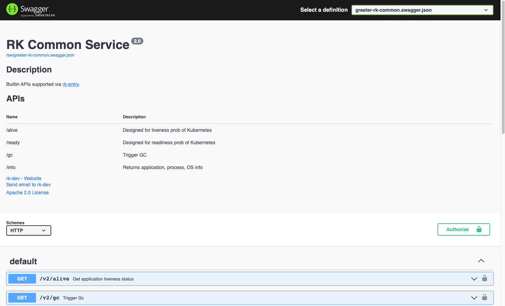

Enable Common API。

## Overview
There are a couple of commonly used APIs implemented in rk-boot.

| Path         | Description             |
|--------------|-------------------------|
| /rk/v1/alive | For K8S liveness        |
| /rk/v1/ready | For K8S readiness       |
| /rk/v1/info  | Return Application Info |
| /rk/v1/gc    | Trigger GC              |

## Install
```bash
go get github.com/rookie-ninja/rk-boot/v2
go get github.com/rookie-ninja/rk-grpc/v2
```

## Options
| Name                          | Description     | Type    | Default |
|-------------------------------|-----------------|---------|---------|
| grpc.commonService.enabled    | 启动 Common API   | boolean | false   |
| grpc.commonService.pathPrefix | Common API 路径前缀 | string  | /rk/v1  |

## Quick start
### 1.Create boot.yaml
```yaml
---
grpc:
  - name: greeter
    port: 8080
#   gwPort: 8081                  # Optional, default: gateway port will be the same as grpc port if not provided
    enabled: true
    commonService:
      enabled: true
#      pathPrefix: ""
```

### 2.Create main.go
```go
package main

import (
	"context"
    "github.com/rookie-ninja/rk-boot/v2"
    _ "github.com/rookie-ninja/rk-grpc/v2/boot"
)

// Application entrance.
func main() {
	// Create a new boot instance.
	boot := rkboot.NewBoot()

	// Bootstrap
	boot.Bootstrap(context.Background())

	// Wait for shutdown sig
	boot.WaitForShutdownSig(context.Background())
}
```

### 3.Validate
```bash
$ curl localhost:8080/rk/v1/ready
{
  "ready": true
}
```

### _**Cheers**_


### 4.Enable swagger UI
```yaml
---
grpc:
  - name: greeter
    port: 8080
    enabled: true
    commonService:
      enabled: true
    sw:
      enabled: true
```

> Validate
>
> [http://localhost:8080/sw](http://localhost:8080/sw)



### _**Cheers**_


