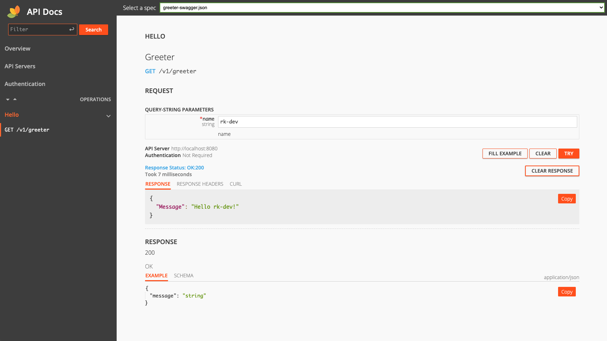

Enable API Docs UI。

## Install
```bash
go get github.com/rookie-ninja/rk-boot/v2
go get github.com/rookie-ninja/rk-grpc/v2
```

## API Docs options
| name | description            | type | default value |
|----------------------|-------------------------------------------------|----------|-------|
| grpc.docs.enabled     | Enable API Docs                                 | boolean  | false |
| grpc.docs.path        | API Docs Web path                               | string   | docs  |
| grpc.docs.specPath    | Local Swagger config file（swagger.json）path     | string   | ""    |
| grpc.docs.headers     | Headers returned by server, format: [key:value] | []string | []    |
| grpc.docs.style.theme | Web UI Theme，support light only currently       | string   | light |
| grpc.docs.debug       | Enable Debug mode                               | bool     | false |

## Quick start
### 1.Create boot.yaml
> rk-boot will search docs/, api/gen/v1/ folder for swagger JSON file
>
> If swagger JSON located at other location，**gin.docs.jsonPath** needs to be configured

```yaml
---
grpc:
  - name: greeter
    port: 8080
    enabled: true
    docs:
      enabled: true                                        # Optional, default: false
#      path: "docs"                                        # Optional, default: "docs"
#      specPath: ""                                        # Optional
#      headers: ["sw:rk"]                                  # Optional, default: []
#      style:                                              # Optional
#        theme: "light"                                    # Optional, default: "light"
#      debug: false                                        # Optional, default: false
```

### 2.Create main.go
```go
package main

import (
	"context"
	"github.com/rookie-ninja/rk-boot/v2"
	"github.com/rookie-ninja/rk-demo/api/gen/v1"
	"github.com/rookie-ninja/rk-grpc/v2/boot"
	"google.golang.org/grpc"
)

func main() {
	boot := rkboot.NewBoot()

	// register grpc
	entry := rkgrpc.GetGrpcEntry("greeter")
	entry.AddRegFuncGrpc(registerGreeter)
	entry.AddRegFuncGw(greeter.RegisterGreeterHandlerFromEndpoint)

	// Bootstrap
	boot.Bootstrap(context.TODO())

	// Wait for shutdown sig
	boot.WaitForShutdownSig(context.TODO())
}

func registerGreeter(server *grpc.Server) {
	greeter.RegisterGreeterServer(server, &GreeterServer{})
}

type GreeterServer struct{}

func (server *GreeterServer) Hello(_ context.Context, _ *greeter.HelloRequest) (*greeter.HelloResponse, error) {
	return &greeter.HelloResponse{
		Message: "hello!",
	}, nil
}
```

### 3.Start main.go
```bash
$ go run main.go
2022-04-17T18:36:57.925+0800    INFO    boot/grpc_entry.go:960  Bootstrap grpcEntry     {"eventId": "1628d013-ad5d-4b8e-9a2f-447404db7157", "entryName": "greeter", "entryType": "gRPCEntry"}
2022-04-17T18:36:57.927+0800    INFO    boot/grpc_entry.go:681  SwaggerEntry: http://localhost:8080/sw/
------------------------------------------------------------------------
endTime=2022-04-17T18:36:57.927808+08:00
startTime=2022-04-17T18:36:57.925577+08:00
elapsedNano=2230586
timezone=CST
ids={"eventId":"1628d013-ad5d-4b8e-9a2f-447404db7157"}
app={"appName":"","appVersion":"","entryName":"greeter","entryType":"gRPCEntry"}
env={"arch":"amd64","domain":"*","hostname":"lark.local","localIP":"192.168.101.5","os":"darwin"}
payloads={"grpcPort":8080,"gwPort":8080,"swEnabled":true,"swPath":"/sw/"}
counters={}
pairs={}
timing={}
remoteAddr=localhost
operation=Bootstrap
resCode=OK
eventStatus=Ended
EOE
```

### 4.Validate
> **API Docs:** [http://localhost:8080/sw](http://localhost:8080/docs)


### _**Cheers**_


## Debug mode
By enable Debug mode，user can use docs UI as the same as swagger UI

### Modify boot.yaml
```yaml
---
grpc:
  - name: greeter
    port: 8080
    enabled: true
    docs:
      enabled: true                                        # Optional, default: false
      debug: true                                          # Optional, default: false
#      path: "docs"                                        # Optional, default: "docs"
#      specPath: ""                                        # Optional
#      headers: ["sw:rk"]                                  # Optional, default: []
#      style:                                              # Optional
#        theme: "light"                                    # Optional, default: "light"
```



### _**Cheers**_

