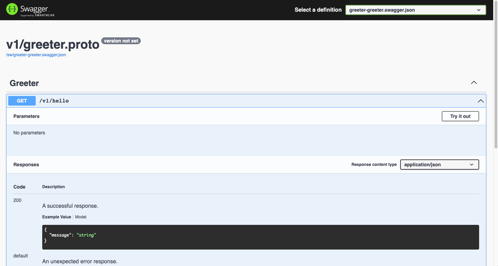

Enable Swagger UI.

## Install
```bash
go get github.com/rookie-ninja/rk-boot/v2
go get github.com/rookie-ninja/rk-grpc/v2
```

## Swagger options
| name | description                              | type | default value |
|-----------------|------------------------------------------|----------|-------|
| grpc.sw.enabled  | Enable Swagger UI                        | boolean  | false |
| grpc.sw.path     | Path of Swagger Web UI                   | string   | sw    |
| grpc.sw.jsonPath | Path Swagger config（swagger.json）file    | string   | ""    |
| grpc.sw.headers     | Headers returned by server, format: [key:value] | []string | []    |

## Quick start
### 1.Create and compile protocol buffer
[Compile protobuf](../buf)

### 2.Create boot.yaml
> rk-boot will search docs/, api/gen/v1/ folder for swagger JSON file
>
> If swagger JSON located at other location，**grpc.sw.jsonPath** needs to be configured

```yaml
---
grpc:
  - name: greeter
    port: 8080
#   gwPort: 8081                  # Optional, default: gateway port will be the same as grpc port if not provided
    enabled: true
    sw:
      enabled: true
#      jsonPath: ""
#      path: "sw"
#      headers: []
```

### 3.Create main.go
```go
package main

import (
  "context"
  "github.com/rookie-ninja/rk-boot/v2"
  "github.com/rookie-ninja/rk-demo/api/gen/v1"
  "github.com/rookie-ninja/rk-grpc/v2/boot"
  "google.golang.org/grpc"
)

func main() {
  boot := rkboot.NewBoot()

  // register grpc
  entry := rkgrpc.GetGrpcEntry("greeter")
  entry.AddRegFuncGrpc(registerGreeter)
  entry.AddRegFuncGw(greeter.RegisterGreeterHandlerFromEndpoint)

  // Bootstrap
  boot.Bootstrap(context.TODO())

  // Wait for shutdown sig
  boot.WaitForShutdownSig(context.TODO())
}

func registerGreeter(server *grpc.Server) {
  greeter.RegisterGreeterServer(server, &GreeterServer{})
}

type GreeterServer struct{}

func (server *GreeterServer) Hello(_ context.Context, _ *greeter.HelloRequest) (*greeter.HelloResponse, error) {
  return &greeter.HelloResponse{
    Message: "hello!",
  }, nil
}
```

### 4.Start main.go
```bash
$ go run main.go
2022-04-17T18:36:57.925+0800    INFO    boot/grpc_entry.go:960  Bootstrap grpcEntry     {"eventId": "1628d013-ad5d-4b8e-9a2f-447404db7157", "entryName": "greeter", "entryType": "gRPCEntry"}
2022-04-17T18:36:57.927+0800    INFO    boot/grpc_entry.go:681  SwaggerEntry: http://localhost:8080/sw/
------------------------------------------------------------------------
endTime=2022-04-17T18:36:57.927808+08:00
startTime=2022-04-17T18:36:57.925577+08:00
elapsedNano=2230586
timezone=CST
ids={"eventId":"1628d013-ad5d-4b8e-9a2f-447404db7157"}
app={"appName":"","appVersion":"","entryName":"greeter","entryType":"gRPCEntry"}
env={"arch":"amd64","domain":"*","hostname":"lark.local","localIP":"192.168.101.5","os":"darwin"}
payloads={"grpcPort":8080,"gwPort":8080,"swEnabled":true,"swPath":"/sw/"}
counters={}
pairs={}
timing={}
remoteAddr=localhost
operation=Bootstrap
resCode=OK
eventStatus=Ended
EOE
```

### 4.Validate
> **Swagger:** [http://localhost:8080/sw](http://localhost:8080/sw)



### _**Cheers**_
