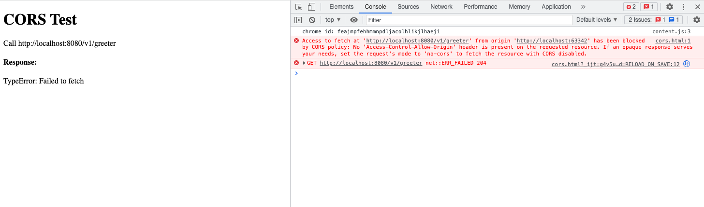

启动 CORS 中间件。

## 安装
```bash
go get github.com/rookie-ninja/rk-boot/v2
go get github.com/rookie-ninja/rk-mux
```

## CORS 选项
| 名字                                   | 描述                                           | 类型       | 默认值                  |
|--------------------------------------|----------------------------------------------|----------|----------------------|
| mux.middleware.cors.enabled          | 启动 CORS 中间件                                  | boolean  | false                |
| mux.middleware.cors.ignore           | 局部选项，忽略 API 路径                               | []string | []                   |
| mux.middleware.cors.allowOrigins     | 可通过验证的 Origin 地址。                            | []string | *                    |
| mux.middleware.cors.allowMethods     | 可通过的 http method, 会包含在 OPTIONS 请求的 Header 中。 | []string | All http methods     |
| mux.middleware.cors.allowHeaders     | 可通过的 http header, 会包含在 OPTIONS 请求的 Header 中。 | []string | Headers from request |
| mux.middleware.cors.allowCredentials | 会包含在 OPTIONS 请求的 Header 中。                   | bool     | false                |
| mux.middleware.cors.exposeHeaders    | 会包含在 OPTIONS 请求的 Header 中的 Header。           | []string | ""                   |
| mux.middleware.cors.maxAge           | 会包含在 OPTIONS 请求的 Header 中的 MaxAge。           | int      | 0                    |

## 快速开始
### 1.创建 boot.yaml
```yaml
---
mux:
  - name: greeter
    port: 8080
    enabled: true
    middleware:
      cors:
        enabled: true
        allowOrigins:
          - "http://localhost:*"
#        ignore: [""]
#        allowCredentials: false
#        allowHeaders: []
#        allowMethods: []
#        exposeHeaders: []
#        maxAge: 0
```

### 2.创建 main.go
```go
// Copyright (c) 2021 rookie-ninja
//
// Use of this source code is governed by an Apache-style
// license that can be found in the LICENSE file.
package main

import (
  "context"
  _ "embed"
  "fmt"
  "github.com/rookie-ninja/rk-boot/v2"
  "github.com/rookie-ninja/rk-mux/boot"
  "github.com/rookie-ninja/rk-mux/middleware"
  "net/http"
)

// @title RK Swagger for Mux
// @version 1.0
// @description This is a greeter service with rk-boot.
func main() {
  // Create a new boot instance.
  boot := rkboot.NewBoot()

  // Get MuxEntry
  muxEntry := rkmux.GetMuxEntry("greeter")
  // Use *mux.Router adding handler.
  muxEntry.Router.NewRoute().Path("/v1/greeter").HandlerFunc(Greeter)

  // Bootstrap
  boot.Bootstrap(context.TODO())

  boot.WaitForShutdownSig(context.TODO())
}

// Greeter handler
// @Summary Greeter service
// @Id 1
// @version 1.0
// @produce application/json
// @Param name query string true "Input name"
// @Success 200 {object} GreeterResponse
// @Router /v1/greeter [get]
func Greeter(writer http.ResponseWriter, req *http.Request) {
  rkmuxmid.WriteJson(writer, http.StatusOK, &GreeterResponse{
    Message: fmt.Sprintf("Hello %s!", req.URL.Query().Get("name")),
  })
}

type GreeterResponse struct {
  Message string
}
```

### 3.创建 cors.html
```html
<!DOCTYPE html>
<html>
<body>

<h1>CORS Test</h1>

<p>Call http://localhost:8080/v1/greeter</p>

<script type="text/javascript">
    window.onload = function() {
        var apiUrl = 'http://localhost:8080/v1/greeter';
        fetch(apiUrl).then(response => response.json()).then(data => {
            document.getElementById("res").innerHTML = data["Message"]
        }).catch(err => {
            document.getElementById("res").innerHTML = err
        });
    };
</script>

<h4>Response: </h4>
<p id="res"></p>

</body>
</html>
```

### 4.文件夹结构
```bash
.
├── boot.yaml
├── cors.html
├── go.mod
├── go.sum
└── main.go

0 directories, 5 files
```

### 5.验证
打开 cors.html


### 6.被拦截的 CORS
将 mux.middleware.cors.allowOrigins 设置成 http://localhost:8080。

```yaml
---
mux:
  - name: greeter
    port: 8080
    enabled: true
    middleware:
      cors:
        enabled: true
        allowOrigins:
          - "http://localhost:8080"
```



### _**Cheers**_
