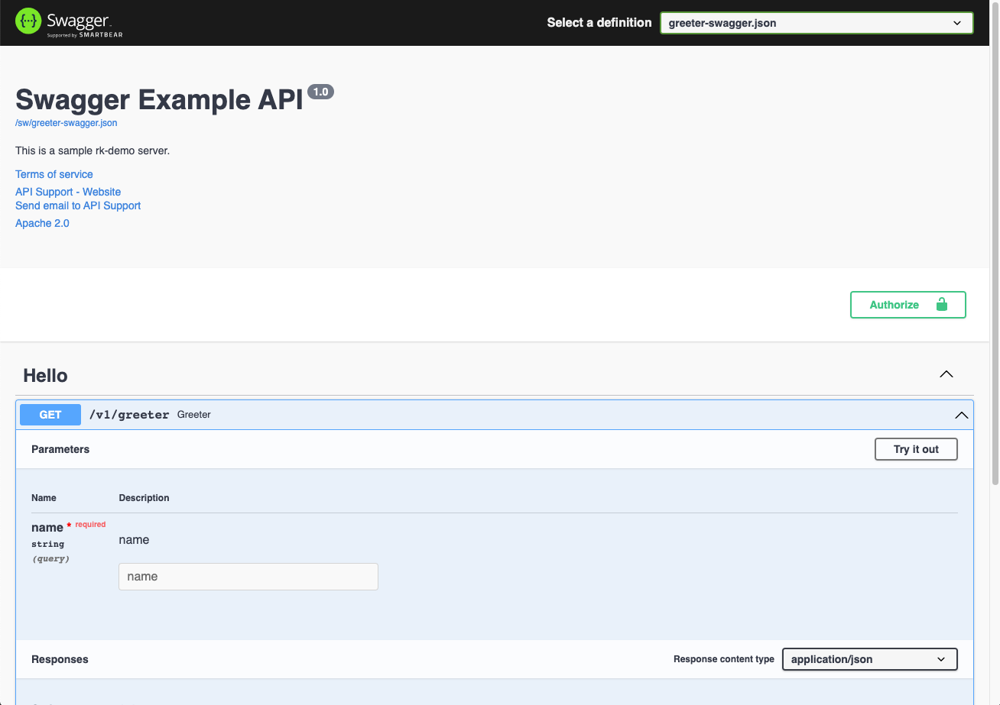

启动 Swagger UI

## 先决条件
我们将使用 [swag](https://github.com/swaggo/swag) 命令行工具来生成 Swagger UI 所需要的 swagger.json 文件。

> 通过 [swag](https://github.com/swaggo/swag) 官网
```bash
$ go get -u github.com/swaggo/swag/cmd/swag
```

## 安装
```bash
go get github.com/rookie-ninja/rk-boot/v2
go get github.com/rookie-ninja/rk-mux
```

## Swagger 选项
| 名字              | 描述                                       | 类型       | 默认值  |
|-----------------|------------------------------------------|----------|------|
| mux.sw.enabled  | 启动 Swagger                               | boolean  | false |
| mux.sw.path     | Swagger Web 界面路径                         | string   | sw   |
| mux.sw.jsonPath | 本地 Swagger 参数文件（swagger.json）路径          | []string | []   |
| mux.sw.headers  | 每次 Swagger 界面请求，都会带着这些头部。格式： [key:value] | []string | []   |

## 快速开始
### 1.创建 boot.yaml
> rk-boot 默认会在 docs/, api/gen/v1/ 文件夹中寻找 swagger JSON 文件。
>
> 如果 swagger JSON 文件在其他的路径，需要在 boot.yaml 文件中指定 **mux.sw.jsonPath**。

```yaml
---
mux:
  - name: greeter
    port: 8080
    enabled: true
    sw:
      enabled: true
#      jsonPath: []
#      path: "sw"
#      headers: []
```

### 2.创建 main.go
> 为了能让 swag 命令行生成 Swagger JSON 文件，我们需要在代码中写注释。
>
> 详情可参考 [swag](https://github.com/swaggo/swag) 官方文档。

```go
// Copyright (c) 2021 rookie-ninja
//
// Use of this source code is governed by an Apache-style
// license that can be found in the LICENSE file.
package main

import (
  "context"
  _ "embed"
  "fmt"
  "github.com/rookie-ninja/rk-boot/v2"
  "github.com/rookie-ninja/rk-mux/boot"
  "github.com/rookie-ninja/rk-mux/middleware"
  "net/http"
)

// @title RK Swagger for Mux
// @version 1.0
// @description This is a greeter service with rk-boot.
func main() {
  // Create a new boot instance.
  boot := rkboot.NewBoot()

  // Get MuxEntry
  muxEntry := rkmux.GetMuxEntry("greeter")
  // Use *mux.Router adding handler.
  muxEntry.Router.NewRoute().Path("/v1/greeter").HandlerFunc(Greeter)

  // Bootstrap
  boot.Bootstrap(context.TODO())

  boot.WaitForShutdownSig(context.TODO())
}

// Greeter handler
// @Summary Greeter service
// @Id 1
// @version 1.0
// @produce application/json
// @Param name query string true "Input name"
// @Success 200 {object} GreeterResponse
// @Router /v1/greeter [get]
func Greeter(writer http.ResponseWriter, req *http.Request) {
  rkmuxmid.WriteJson(writer, http.StatusOK, &GreeterResponse{
    Message: fmt.Sprintf("Hello %s!", req.URL.Query().Get("name")),
  })
}

type GreeterResponse struct {
  Message string
}
```

### 3.生成 swagger 参数文件
```bash
$ swag init

# swagger.json, swagger.yaml, docs.go files will be generated under ./docs folder.
$ tree
.
├── boot.yaml
├── docs
│   ├── docs.go
│   ├── swagger.json
│   └── swagger.yaml
├── go.mod
├── go.sum
└── main.go

1 directory, 7 files
```

### 4.验证
> **Swagger:** [http://localhost:8080/sw](http://localhost:8080/sw)



### _**Cheers**_
