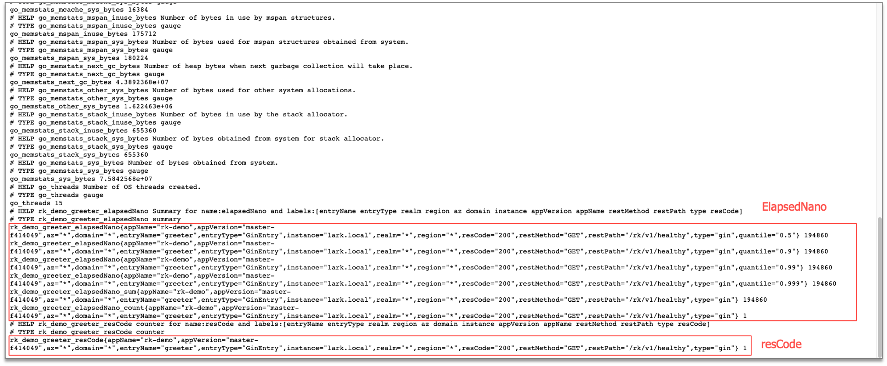

Enable Prometheus middleware

## Install
```bash
go get github.com/rookie-ninja/rk-boot/v2
go get github.com/rookie-ninja/rk-zero
```

## Options
| options                      | description                  | type     | default |
|------------------------------|------------------------------|----------|---------|
| zero.middleware.prom.enabled | Enable Prometheus middleware | boolean  | false   |
| zero.middleware.prom.ignore  | Ignore by path               | []string | []      |

## Concept
Prometheus middleware will record bellow information

| Fields      | Type    | Description              |
|-------------|---------|--------------------------|
| elapsedNano | Summary | RPC elapsed time in nano |
| resCode     | Counter | Counter of response code |

Labels as bellow:

| Label      | Description                   |
|------------|-------------------------------|
| entryName  | Entry name                    |
| entryType  | Entry type                    |
| domain     | ENV value of DOMAIN, eg: prod |
| instance   | Hostname                      |
| restMethod | eg: GET                       |
| restPath   | eg: /rk/v1/alive              |
| resCode    | Response code, eg: 200        |

Example

```bash
rk_prom_elapsedNano{domain="*",entryName="greeter",entryType="ZeroEntry",instance="lark.local",resCode="200",restMethod="GET",restPath="/v1/greeter",quantile="0.5"} 88645
...
rk_prom_resCode{domain="*",entryName="greeter",entryType="ZeroEntry",instance="lark.local",resCode="200",restMethod="GET",restPath="/v1/greeter"} 1
```

## Quick start
### 1.Create boot.yaml
```yaml
---
zero:
  - name: greeter
    port: 8080
    enabled: true
    prom:
      enabled : true
    middleware:
      prom:
        enabled: true
#        ignore: [""]
```

### 2.Create main.go
```go
package main

import (
  "context"
  "encoding/json"
  "fmt"
  "github.com/rookie-ninja/rk-boot/v2"
  "github.com/rookie-ninja/rk-zero/boot"
  "github.com/zeromicro/go-zero/rest"
  "net/http"
)

// @title Swagger Example API
// @version 1.0
// @description This is a sample rk-demo server.
// @termsOfService http://swagger.io/terms/

// @securityDefinitions.basic BasicAuth

// @contact.name API Support
// @contact.url http://www.swagger.io/support
// @contact.email support@swagger.io

// @license.name Apache 2.0
// @license.url http://www.apache.org/licenses/LICENSE-2.0.html

func main() {
  // Create a new boot instance.
  boot := rkboot.NewBoot()

  // Register handler
  zeroEntry := rkzero.GetZeroEntry("greeter")
  zeroEntry.Server.AddRoute(rest.Route{
    Method:  http.MethodGet,
    Path:    "/v1/greeter",
    Handler: Greeter,
  })

  // Bootstrap
  boot.Bootstrap(context.TODO())

  boot.WaitForShutdownSig(context.TODO())
}

// Greeter handler
// @Summary Greeter
// @Id 1
// @Tags Hello
// @version 1.0
// @Param name query string true "name"
// @produce application/json
// @Success 200 {object} GreeterResponse
// @Router /v1/greeter [get]
func Greeter(writer http.ResponseWriter, request *http.Request) {
  writer.WriteHeader(http.StatusOK)
  resp := &GreeterResponse{
    Message: fmt.Sprintf("Hello %s!", request.URL.Query().Get("name")),
  }
  bytes, _ := json.Marshal(resp)
  writer.Write(bytes)
}

type GreeterResponse struct {
  Message string
}
```

### 3.Validate
> Send request

```bash
$ curl "localhost:8080/v1/greeter?name=rk-dev"
{"Message":"Hello rk-dev!"}
```

> Prometheus client:
>
> http://localhost:8080/metrics



### _**Cheers**_

