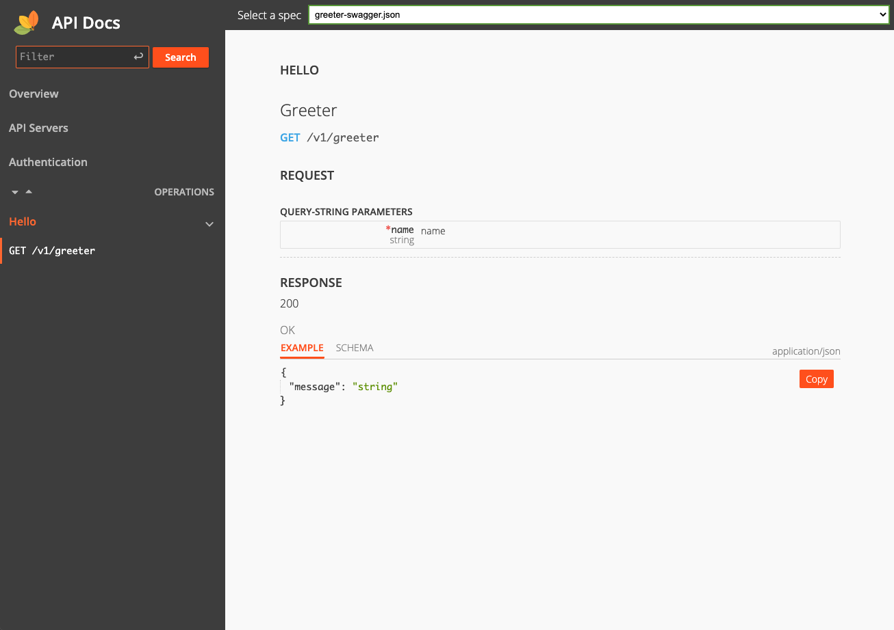

Enable API Docs UI

## Prerequisite
We will use [swag](https://github.com/swaggo/swag) to generate swagger UI config files.

> Through [swag](https://github.com/swaggo/swag)
```bash
$ go get -u github.com/swaggo/swag/cmd/swag
```

## Install
```bash
go get github.com/rookie-ninja/rk-boot/v2
go get github.com/rookie-ninja/rk-zero
```

## API Docs options
| name                  | description                                     | type     | default value |
|-----------------------|-------------------------------------------------|----------|---------------|
| zero.docs.enabled     | Enable API Docs                                 | boolean  | false         |
| zero.docs.path        | API Docs Web path                               | string   | docs          |
| zero.docs.specPath    | Local Swagger config file（swagger.json）path     | string   | ""            |
| zero.docs.headers     | Headers returned by server, format: [key:value] | []string | []            |
| zero.docs.style.theme | Web UI Theme，support light only currently       | string   | light         |
| zero.docs.debug       | Enable Debug mode                               | bool     | false         |

## Quick start
### 1.Create boot.yaml
> rk-boot will search docs/, api/gen/v1/ folder for swagger JSON file
>
> If swagger JSON located at other location，**zero.docs.jsonPath** needs to be configured

```yaml
---
zero:
  - name: greeter
    port: 8080
    enabled: true
    docs:
      enabled: true                                        # Optional, default: false
#      path: "docs"                                        # Optional, default: "docs"
#      specPath: ""                                        # Optional
#      headers: ["sw:rk"]                                  # Optional, default: []
#      style:                                              # Optional
#        theme: "light"                                    # Optional, default: "light"
#      debug: false                                        # Optional, default: false
```

### 2.Create main.go
> In order to create Swagger JSON file with swag，comments needs to be added in codes
>
> Please refer to [swag](https://github.com/swaggo/swag)

```go
package main

import (
  "context"
  "encoding/json"
  "fmt"
  "github.com/rookie-ninja/rk-boot/v2"
  "github.com/rookie-ninja/rk-zero/boot"
  "github.com/zeromicro/go-zero/rest"
  "net/http"
)

// @title Swagger Example API
// @version 1.0
// @description This is a sample rk-demo server.
// @termsOfService http://swagger.io/terms/

// @securityDefinitions.basic BasicAuth

// @contact.name API Support
// @contact.url http://www.swagger.io/support
// @contact.email support@swagger.io

// @license.name Apache 2.0
// @license.url http://www.apache.org/licenses/LICENSE-2.0.html

func main() {
  // Create a new boot instance.
  boot := rkboot.NewBoot()

  // Register handler
  zeroEntry := rkzero.GetZeroEntry("greeter")
  zeroEntry.Server.AddRoute(rest.Route{
    Method:  http.MethodGet,
    Path:    "/v1/greeter",
    Handler: Greeter,
  })

  // Bootstrap
  boot.Bootstrap(context.TODO())

  boot.WaitForShutdownSig(context.TODO())
}

// Greeter handler
// @Summary Greeter
// @Id 1
// @Tags Hello
// @version 1.0
// @Param name query string true "name"
// @produce application/json
// @Success 200 {object} GreeterResponse
// @Router /v1/greeter [get]
func Greeter(writer http.ResponseWriter, request *http.Request) {
  writer.WriteHeader(http.StatusOK)
  resp := &GreeterResponse{
    Message: fmt.Sprintf("Hello %s!", request.URL.Query().Get("name")),
  }
  bytes, _ := json.Marshal(resp)
  writer.Write(bytes)
}

type GreeterResponse struct {
  Message string
}
```

### 3.Generate swagger config
```bash
$ swag init

# swagger.json, swagger.yaml, docs.go files will be generated under ./docs folder.
$ tree
.
├── boot.yaml
├── docs
│   ├── docs.go
│   ├── swagger.json
│   └── swagger.yaml
├── go.mod
├── go.sum
└── main.go

1 directory, 7 files
```

### 4.Validate
> **API Docs:** [http://localhost:8080/sw](http://localhost:8080/docs)



### _**Cheers**_


## Debug mode
By enable Debug mode，user can use docs UI as the same as swagger UI

### Modify boot.yaml
```yaml
---
zero:
  - name: greeter
    port: 8080
    enabled: true
    docs:
      enabled: true                                        # Optional, default: false
      debug: true                                          # Optional, default: false
#      path: "docs"                                        # Optional, default: "docs"
#      specPath: ""                                        # Optional
#      headers: ["sw:rk"]                                  # Optional, default: []
#      style:                                              # Optional
#        theme: "light"                                    # Optional, default: "light"
```


### _**Cheers**_

